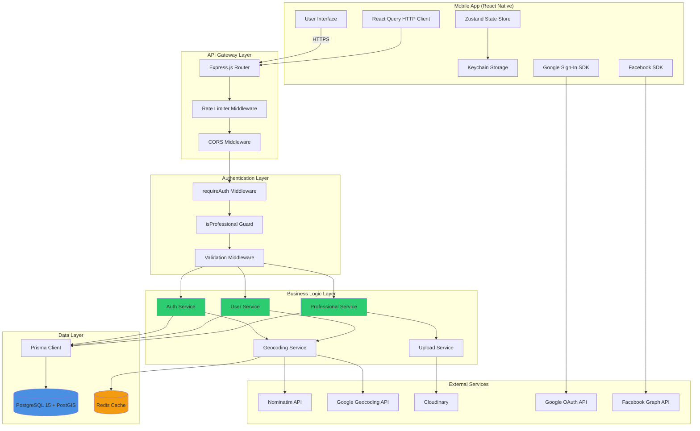
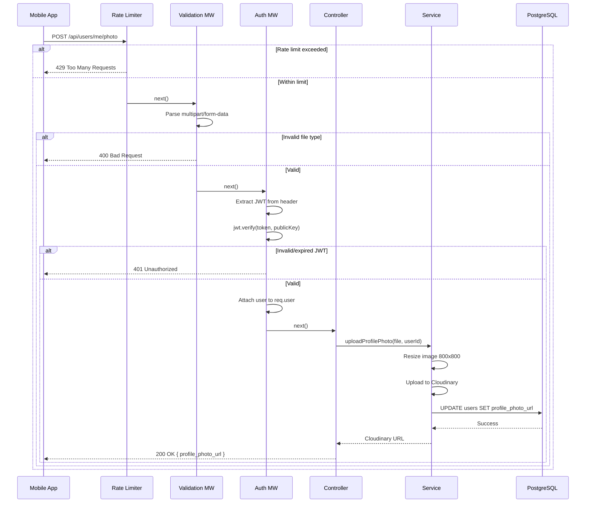
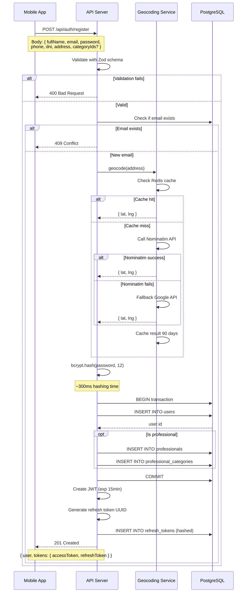
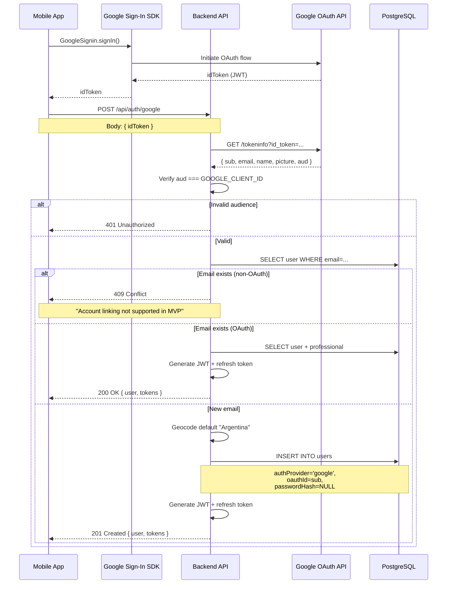
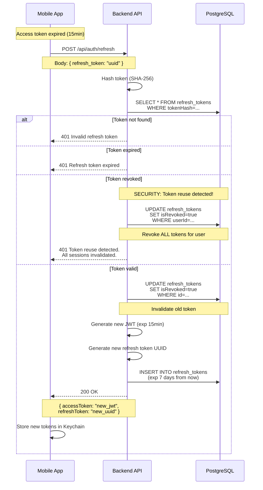
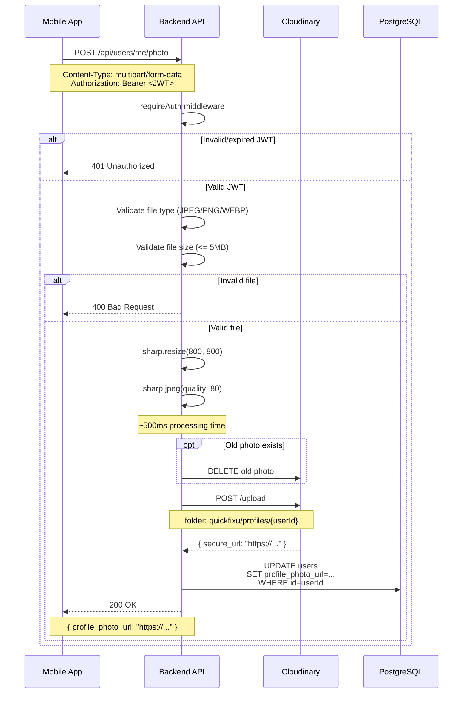

# Design: Fase 1 - Core Authentication & Profiles

## 1. Technical Approach

This design implements **JWT-based authentication with refresh token rotation**, **OAuth 2.0 social sign-in** (Google/Facebook), **PostGIS-powered geocoding**, and **Cloudinary media storage** for QuickFixU's foundational authentication and profile management system.

**Architecture strategy:**
- **Backend-first:** Complete REST API with full test coverage before mobile integration
- **Security-layered:** RS256 JWT + bcrypt cost 12 + httpOnly cookies + refresh token rotation
- **Geocoding hybrid:** Nominatim (free, primary) with Google Places fallback (paid, reliable)
- **OAuth native SDKs:** Mobile-native Google/Facebook libraries (NOT WebView Passport.js)
- **Role derivation:** No `role` field in DB; role inferred from `professionals` table join (matches spec: "derive from presence of professional record")

**Alignment with spec:**
- Implements ALL 12 functional requirements (FR-001 through FR-012)
- Meets NFR performance targets: login <200ms p50, geocoding <50ms cache hit
- Follows API contract exactly (13 endpoints with specified request/response shapes)
- Security: bcrypt cost 12, JWT RS256, refresh token rotation with reuse detection

---

## 2. Architecture Overview

### 2.1 High-Level System Diagram



### 2.2 Component Interaction Flow

**Registration Flow (Email/Password):**
```
Mobile App
  → POST /api/auth/register
    → Rate Limiter (check 10 req/min)
      → Validation Middleware (Zod schema)
        → Auth Controller
          → Auth Service
            ├→ Geocoding Service
            │   ├→ Redis (check cache)
            │   ├→ Nominatim API (primary)
            │   └→ Google Geocoding (fallback)
            ├→ bcrypt.hash(password, 12)
            ├→ Prisma.user.create()
            ├→ JWT.sign(userId, 'RS256')
            └→ createRefreshToken()
          ← { user, tokens }
        ← 201 Created
      ← Response
```

**OAuth Flow (Google):**
```
Mobile App
  → GoogleSignin.signIn()
    ← idToken (JWT from Google)
  → POST /api/auth/google { idToken }
    → Auth Controller
      → Auth Service
        → verifyGoogleToken(idToken)
          → Google OAuth API (verify signature)
            ← { email, name, picture }
        → Prisma.user.upsert(email)
        → JWT.sign + createRefreshToken
        ← { user, tokens }
      ← 200 OK / 201 Created
```

**Protected Route Access:**
```
Mobile App
  → GET /api/users/me
    + Header: Authorization Bearer <JWT>
    → requireAuth Middleware
      ├→ Extract JWT from header
      ├→ jwt.verify(token, publicKey, RS256)
      ├→ Attach user to req.user
      └→ next()
    → User Controller
      → User Service
        → Prisma.user.findUnique(req.user.id)
        ← user + professional data
      ← 200 OK
```

---

## 3. Database Schema (Prisma)

### 3.1 Complete Prisma Schema

```prisma
// prisma/schema.prisma

generator client {
  provider        = "prisma-client-js"
  previewFeatures = ["postgresqlExtensions"]
}

datasource db {
  provider   = "postgresql"
  url        = env("DATABASE_URL")
  extensions = [postgis]
}

// ============================================================
// USER MODELS
// ============================================================

model User {
  id              Int       @id @default(autoincrement())
  fullName        String    @map("full_name") @db.VarChar(255)
  email           String    @unique @db.VarChar(255)
  passwordHash    String?   @map("password_hash") @db.VarChar(255) // NULL for OAuth users
  phone           String    @db.VarChar(20)
  dni             String    @db.VarChar(10)
  address         String    @db.Text
  latitude        Decimal   @db.Decimal(10, 8)  // -90 to 90, 8 decimal precision (~1mm)
  longitude       Decimal   @db.Decimal(11, 8)  // -180 to 180
  profilePhotoUrl String?   @map("profile_photo_url") @db.VarChar(500)
  rating          Decimal   @default(0) @db.Decimal(3, 2) // 0.00 to 5.00
  ratingCount     Int       @default(0) @map("rating_count")
  authProvider    String?   @map("auth_provider") @db.VarChar(50) // 'email' | 'google' | 'facebook'
  oauthId         String?   @map("oauth_id") @db.VarChar(255) // Google/Facebook user ID
  isActive        Boolean   @default(true) @map("is_active")
  blockedReason   String?   @map("blocked_reason") @db.Text
  createdAt       DateTime  @default(now()) @map("created_at") @db.Timestamptz
  updatedAt       DateTime  @updatedAt @map("updated_at") @db.Timestamptz

  // Relations
  professional     Professional?
  refreshTokens    RefreshToken[]
  
  // Indexes
  @@index([email])
  @@index([isActive])
  @@index([latitude, longitude]) // PostGIS spatial queries
  @@map("users")
}

model Professional {
  id               Int       @id @default(autoincrement())
  userId           Int       @unique @map("user_id")
  yearsExperience  Int       @map("years_experience")
  description      String    @db.Text
  createdAt        DateTime  @default(now()) @map("created_at") @db.Timestamptz
  updatedAt        DateTime  @updatedAt @map("updated_at") @db.Timestamptz

  // Relations
  user                 User                      @relation(fields: [userId], references: [id], onDelete: Cascade)
  categories           ProfessionalCategory[]
  certifications       Certification[]
  
  @@index([userId])
  @@map("professionals")
}

model Category {
  id          Int       @id @default(autoincrement())
  name        String    @db.VarChar(100)
  slug        String    @unique @db.VarChar(100)
  icon        String    @db.VarChar(10) // Emoji or icon identifier
  createdAt   DateTime  @default(now()) @map("created_at") @db.Timestamptz

  // Relations
  professionals  ProfessionalCategory[]
  
  @@index([slug])
  @@map("categories")
}

model ProfessionalCategory {
  professionalId  Int  @map("professional_id")
  categoryId      Int  @map("category_id")

  // Relations
  professional  Professional  @relation(fields: [professionalId], references: [id], onDelete: Cascade)
  category      Category      @relation(fields: [categoryId], references: [id], onDelete: Cascade)

  @@id([professionalId, categoryId])
  @@index([professionalId])
  @@index([categoryId])
  @@map("professional_categories")
}

model Certification {
  id              Int       @id @default(autoincrement())
  professionalId  Int       @map("professional_id")
  fileUrl         String    @map("file_url") @db.VarChar(500) // Cloudinary URL
  status          String    @db.VarChar(20) @default("pending") // 'pending' | 'approved' | 'rejected'
  uploadedAt      DateTime  @default(now()) @map("uploaded_at") @db.Timestamptz
  reviewedAt      DateTime? @map("reviewed_at") @db.Timestamptz
  reviewedBy      Int?      @map("reviewed_by") // Admin user ID (Fase 2)

  // Relations
  professional  Professional  @relation(fields: [professionalId], references: [id], onDelete: Cascade)

  @@index([professionalId])
  @@index([status])
  @@map("certifications")
}

// ============================================================
// AUTHENTICATION MODELS
// ============================================================

model RefreshToken {
  id          Int       @id @default(autoincrement())
  userId      Int       @map("user_id")
  tokenHash   String    @unique @map("token_hash") @db.VarChar(64) // SHA-256 hash
  expiresAt   DateTime  @map("expires_at") @db.Timestamptz
  isRevoked   Boolean   @default(false) @map("is_revoked")
  createdAt   DateTime  @default(now()) @map("created_at") @db.Timestamptz

  // Relations
  user  User  @relation(fields: [userId], references: [id], onDelete: Cascade)

  @@index([userId, expiresAt])
  @@index([tokenHash])
  @@map("refresh_tokens")
}
```

### 3.2 PostGIS Spatial Index

**Manual migration for PostGIS geography column + GIST index:**

```sql
-- Run after initial Prisma migration

-- Add PostGIS geography column (not supported by Prisma schema directly)
ALTER TABLE users ADD COLUMN location GEOGRAPHY(POINT, 4326);

-- Populate location from lat/lng
UPDATE users SET location = ST_SetSRID(ST_MakePoint(longitude::float, latitude::float), 4326)::geography;

-- Create spatial index (GIST for geography type)
CREATE INDEX idx_users_location ON users USING GIST(location);

-- Example query: Find professionals within 30km radius
-- SELECT * FROM users u
-- JOIN professionals p ON u.id = p.user_id
-- WHERE ST_DWithin(u.location, ST_SetSRID(ST_MakePoint(-58.381592, -34.603722), 4326)::geography, 30000);
-- (30000 = 30km in meters)
```

### 3.3 Database Indexes Strategy

| Index | Purpose | Query Performance Impact |
|-------|---------|--------------------------|
| `idx_users_email` | Login, OAuth email lookup | 10-100x faster (hash index) |
| `idx_users_location` | 30km radius searches | 50-200x faster (GIST spatial index) |
| `idx_refresh_tokens_user_expires` | Token validation | 5-10x faster (composite index) |
| `idx_professional_categories_professional` | Professional profile queries | 10-20x faster (JOIN optimization) |
| `idx_certifications_status` | Admin review dashboard | 5-10x faster (filter pending) |

---

## 4. API Architecture

### 4.1 Folder Structure

```
backend/
├── src/
│   ├── config/
│   │   ├── database.ts         // Prisma singleton client
│   │   ├── jwt.ts              // RS256 sign/verify utilities
│   │   ├── cloudinary.ts       // Cloudinary v2 config
│   │   ├── redis.ts            // Redis client singleton
│   │   └── constants.ts        // App constants (token expiry, etc.)
│   ├── middleware/
│   │   ├── auth.middleware.ts  // requireAuth, isProfessional guards
│   │   ├── validation.middleware.ts  // Zod schema validators
│   │   ├── error.middleware.ts       // Global error handler
│   │   ├── rateLimit.middleware.ts   // express-rate-limit config
│   │   └── multer.middleware.ts      // File upload parser
│   ├── services/
│   │   ├── auth.service.ts           // JWT creation, OAuth verification
│   │   ├── user.service.ts           // User CRUD operations
│   │   ├── professional.service.ts   // Professional CRUD + categories
│   │   ├── geocoding.service.ts      // Nominatim + Google hybrid
│   │   └── upload.service.ts         // Cloudinary upload/delete
│   ├── controllers/
│   │   ├── auth.controller.ts        // /auth/* handlers
│   │   ├── user.controller.ts        // /users/* handlers
│   │   ├── professional.controller.ts // /professionals/* handlers
│   │   └── category.controller.ts    // /categories/* handlers
│   ├── routes/
│   │   ├── auth.routes.ts            // Auth endpoints
│   │   ├── user.routes.ts            // User endpoints
│   │   ├── professional.routes.ts    // Professional endpoints
│   │   └── category.routes.ts        // Category endpoints
│   ├── types/
│   │   ├── express.d.ts              // Extend Request with user
│   │   ├── auth.types.ts             // Auth DTOs, interfaces
│   │   └── errors.types.ts           // Custom error classes
│   ├── utils/
│   │   ├── validators.ts             // Custom validation functions
│   │   ├── hash.ts                   // SHA-256 utility
│   │   └── logger.ts                 // Winston logger setup
│   ├── app.ts                        // Express app setup
│   └── server.ts                     // HTTP server entry point
├── prisma/
│   ├── schema.prisma
│   ├── migrations/
│   │   └── 20260322000000_init/
│   │       └── migration.sql
│   └── seed.ts                       // Seed 3 categories
├── tests/
│   ├── unit/
│   │   ├── services/
│   │   └── middleware/
│   ├── integration/
│   │   ├── auth.test.ts
│   │   ├── user.test.ts
│   │   └── professional.test.ts
│   └── setup.ts                      // Jest global setup
├── keys/
│   ├── private.pem                   // JWT private key (gitignored)
│   └── public.pem                    // JWT public key (gitignored)
├── .env.example
├── .gitignore
├── package.json
├── tsconfig.json
└── jest.config.js
```

### 4.2 Express App Setup

```typescript
// src/app.ts

import express from 'express';
import helmet from 'helmet';
import cors from 'cors';
import { errorMiddleware } from './middleware/error.middleware';
import { rateLimitMiddleware } from './middleware/rateLimit.middleware';
import authRoutes from './routes/auth.routes';
import userRoutes from './routes/user.routes';
import professionalRoutes from './routes/professional.routes';
import categoryRoutes from './routes/category.routes';

const app = express();

// Security middleware
app.use(helmet());
app.use(cors({
  origin: process.env.CORS_ORIGINS?.split(',') || ['http://localhost:3000'],
  credentials: true,
}));

// Body parsing
app.use(express.json({ limit: '10mb' }));
app.use(express.urlencoded({ extended: true }));

// Global rate limiting
app.use(rateLimitMiddleware);

// Health check
app.get('/health', (req, res) => {
  res.status(200).json({ status: 'ok', timestamp: new Date().toISOString() });
});

// Routes
app.use('/api/auth', authRoutes);
app.use('/api/users', userRoutes);
app.use('/api/professionals', professionalRoutes);
app.use('/api/categories', categoryRoutes);

// Error handler (MUST be last)
app.use(errorMiddleware);

export default app;
```

---

## 5. Key Services Design

### 5.1 Auth Service

```typescript
// src/services/auth.service.ts

import bcrypt from 'bcrypt';
import { v4 as uuidv4 } from 'uuid';
import crypto from 'crypto';
import { signToken, verifyToken } from '../config/jwt';
import prisma from '../config/database';
import { AppError } from '../types/errors.types';
import { geocodingService } from './geocoding.service';
import axios from 'axios';

interface RegisterDto {
  fullName: string;
  email: string;
  password?: string; // Optional for OAuth
  phone: string;
  dni: string;
  address: string;
  // Professional fields
  yearsExperience?: number;
  description?: string;
  categoryIds?: number[];
  // OAuth fields
  authProvider?: 'email' | 'google' | 'facebook';
  oauthId?: string;
  profilePhotoUrl?: string;
}

interface AuthResponse {
  user: any; // Replace with proper DTO type
  tokens: {
    accessToken: string;
    refreshToken: string;
  };
}

class AuthService {
  /**
   * Register new user (client or professional)
   */
  async register(data: RegisterDto): Promise<AuthResponse> {
    // Check if email exists
    const existingUser = await prisma.user.findUnique({
      where: { email: data.email },
    });

    if (existingUser) {
      throw new AppError(409, 'Email already registered');
    }

    // Geocode address
    const { latitude, longitude } = await geocodingService.geocode(data.address);

    // Hash password (skip for OAuth)
    let passwordHash: string | null = null;
    if (data.password) {
      passwordHash = await bcrypt.hash(data.password, 12); // Cost factor 12
    }

    // Determine if professional (has categoryIds)
    const isProfessional = Boolean(data.categoryIds && data.categoryIds.length > 0);

    // Create user + professional in transaction
    const user = await prisma.$transaction(async (tx) => {
      const newUser = await tx.user.create({
        data: {
          fullName: data.fullName,
          email: data.email,
          passwordHash,
          phone: data.phone,
          dni: data.dni,
          address: data.address,
          latitude,
          longitude,
          authProvider: data.authProvider || 'email',
          oauthId: data.oauthId,
          profilePhotoUrl: data.profilePhotoUrl,
        },
      });

      // Create professional record + categories if applicable
      if (isProfessional) {
        const professional = await tx.professional.create({
          data: {
            userId: newUser.id,
            yearsExperience: data.yearsExperience!,
            description: data.description!,
          },
        });

        // Create professional_categories links
        await tx.professionalCategory.createMany({
          data: data.categoryIds!.map((categoryId) => ({
            professionalId: professional.id,
            categoryId,
          })),
        });
      }

      return newUser;
    });

    // Generate tokens
    const accessToken = signToken(user.id);
    const refreshToken = await this.createRefreshToken(user.id);

    return {
      user: await this.getUserWithRole(user.id),
      tokens: { accessToken, refreshToken },
    };
  }

  /**
   * Login with email/password
   */
  async login(email: string, password: string): Promise<AuthResponse> {
    // Fetch user
    const user = await prisma.user.findUnique({ where: { email } });

    // Timing attack protection: always compare hash even if user doesn't exist
    const hash = user?.passwordHash || '$2b$12$XXXXXXXXXXXXXXXXXXXXXXXXXXXXXXXXXXXXXXXXXXXXXX'; // Dummy hash
    const isValid = await bcrypt.compare(password, hash);

    if (!user || !isValid) {
      throw new AppError(401, 'Invalid credentials');
    }

    if (!user.isActive) {
      throw new AppError(403, 'Account is blocked. Contact support.');
    }

    // Generate tokens
    const accessToken = signToken(user.id);
    const refreshToken = await this.createRefreshToken(user.id);

    return {
      user: await this.getUserWithRole(user.id),
      tokens: { accessToken, refreshToken },
    };
  }

  /**
   * OAuth Google sign-in
   */
  async oauthGoogle(idToken: string): Promise<AuthResponse> {
    // Verify token with Google
    const payload = await this.verifyGoogleToken(idToken);

    // Check if user exists
    let user = await prisma.user.findUnique({ where: { email: payload.email } });

    if (user && user.authProvider !== 'google') {
      throw new AppError(409, 'Email already registered with email/password. Account linking not supported in MVP.');
    }

    if (!user) {
      // Create new user
      const { latitude, longitude } = await geocodingService.geocode('Argentina'); // Default location

      user = await prisma.user.create({
        data: {
          fullName: payload.name,
          email: payload.email,
          authProvider: 'google',
          oauthId: payload.sub,
          profilePhotoUrl: payload.picture,
          phone: '', // Will update in profile edit
          dni: '', // Will update in profile edit
          address: 'Argentina',
          latitude,
          longitude,
        },
      });
    }

    const accessToken = signToken(user.id);
    const refreshToken = await this.createRefreshToken(user.id);

    return {
      user: await this.getUserWithRole(user.id),
      tokens: { accessToken, refreshToken },
    };
  }

  /**
   * OAuth Facebook sign-in
   */
  async oauthFacebook(accessToken: string): Promise<AuthResponse> {
    // Verify token and fetch profile
    const profile = await this.verifyFacebookToken(accessToken);

    if (!profile.email) {
      throw new AppError(400, 'Email permission required. Please allow email access in Facebook settings.');
    }

    // Check if user exists
    let user = await prisma.user.findUnique({ where: { email: profile.email } });

    if (user && user.authProvider !== 'facebook') {
      throw new AppError(409, 'Email already registered with different provider.');
    }

    if (!user) {
      const { latitude, longitude } = await geocodingService.geocode('Argentina');

      user = await prisma.user.create({
        data: {
          fullName: profile.name,
          email: profile.email,
          authProvider: 'facebook',
          oauthId: profile.id,
          profilePhotoUrl: profile.picture?.data?.url,
          phone: '',
          dni: '',
          address: 'Argentina',
          latitude,
          longitude,
        },
      });
    }

    const accessToken = signToken(user.id);
    const refreshToken = await this.createRefreshToken(user.id);

    return {
      user: await this.getUserWithRole(user.id),
      tokens: { accessToken, refreshToken },
    };
  }

  /**
   * Refresh access token
   */
  async refreshAccessToken(refreshToken: string): Promise<{ accessToken: string; refreshToken: string }> {
    const tokenHash = crypto.createHash('sha256').update(refreshToken).digest('hex');

    const storedToken = await prisma.refreshToken.findUnique({
      where: { tokenHash },
    });

    if (!storedToken) {
      throw new AppError(401, 'Invalid refresh token');
    }

    if (storedToken.isRevoked) {
      // Token reuse detected → revoke all tokens for user
      await prisma.refreshToken.updateMany({
        where: { userId: storedToken.userId },
        data: { isRevoked: true },
      });
      throw new AppError(401, 'Token reuse detected. All sessions invalidated for security.');
    }

    if (storedToken.expiresAt < new Date()) {
      throw new AppError(401, 'Refresh token expired. Please login again.');
    }

    // Rotate token: revoke old, create new
    await prisma.refreshToken.update({
      where: { id: storedToken.id },
      data: { isRevoked: true },
    });

    const newAccessToken = signToken(storedToken.userId);
    const newRefreshToken = await this.createRefreshToken(storedToken.userId);

    return {
      accessToken: newAccessToken,
      refreshToken: newRefreshToken,
    };
  }

  /**
   * Logout (revoke refresh token)
   */
  async logout(refreshToken: string): Promise<void> {
    const tokenHash = crypto.createHash('sha256').update(refreshToken).digest('hex');

    // Idempotent: don't fail if token doesn't exist
    await prisma.refreshToken.updateMany({
      where: { tokenHash },
      data: { isRevoked: true },
    });
  }

  /**
   * Create refresh token (UUID, hashed in DB)
   */
  async createRefreshToken(userId: number): Promise<string> {
    const token = uuidv4();
    const tokenHash = crypto.createHash('sha256').update(token).digest('hex');
    const expiresAt = new Date(Date.now() + 7 * 24 * 60 * 60 * 1000); // 7 days

    await prisma.refreshToken.create({
      data: {
        userId,
        tokenHash,
        expiresAt,
      },
    });

    return token;
  }

  /**
   * Verify Google ID token
   */
  private async verifyGoogleToken(idToken: string): Promise<any> {
    try {
      const response = await axios.get(`https://oauth2.googleapis.com/tokeninfo?id_token=${idToken}`);
      const payload = response.data;

      // Verify audience (client ID)
      if (payload.aud !== process.env.GOOGLE_CLIENT_ID) {
        throw new Error('Invalid audience');
      }

      return payload;
    } catch (error) {
      throw new AppError(401, 'Invalid Google authentication token');
    }
  }

  /**
   * Verify Facebook access token
   */
  private async verifyFacebookToken(accessToken: string): Promise<any> {
    try {
      // Validate token
      const debugResponse = await axios.get(
        `https://graph.facebook.com/debug_token?input_token=${accessToken}&access_token=${process.env.FACEBOOK_APP_ID}|${process.env.FACEBOOK_APP_SECRET}`
      );

      if (!debugResponse.data.data.is_valid) {
        throw new Error('Invalid token');
      }

      // Fetch profile
      const profileResponse = await axios.get(
        `https://graph.facebook.com/me?fields=id,name,email,picture&access_token=${accessToken}`
      );

      return profileResponse.data;
    } catch (error) {
      throw new AppError(401, 'Invalid Facebook authentication token');
    }
  }

  /**
   * Get user with role (professional data if exists)
   */
  private async getUserWithRole(userId: number): Promise<any> {
    return await prisma.user.findUnique({
      where: { id: userId },
      include: {
        professional: {
          include: {
            categories: {
              include: {
                category: true,
              },
            },
            certifications: true,
          },
        },
      },
    });
  }
}

export const authService = new AuthService();
```

### 5.2 Geocoding Service

```typescript
// src/services/geocoding.service.ts

import axios from 'axios';
import Redis from 'ioredis';
import crypto from 'crypto';
import { AppError } from '../types/errors.types';

interface Coordinates {
  latitude: number;
  longitude: number;
}

class GeocodingService {
  private redis: Redis;

  constructor() {
    this.redis = new Redis(process.env.REDIS_URL || 'redis://localhost:6379');
  }

  /**
   * Geocode address to lat/lng with cache + fallback
   */
  async geocode(address: string): Promise<Coordinates> {
    // Check cache first
    const cached = await this.getCachedGeocode(address);
    if (cached) {
      return cached;
    }

    // Try Nominatim first (free)
    try {
      const coords = await this.geocodeNominatim(address);
      await this.cacheGeocode(address, coords);
      return coords;
    } catch (error) {
      console.warn('Nominatim geocoding failed, falling back to Google:', error);
    }

    // Fallback to Google Geocoding API
    try {
      const coords = await this.geocodeGoogle(address);
      await this.cacheGeocode(address, coords);
      return coords;
    } catch (error) {
      console.error('Both Nominatim and Google geocoding failed:', error);
      throw new AppError(503, 'Geocoding service temporarily unavailable. Please try again later.');
    }
  }

  /**
   * Geocode with Nominatim (OpenStreetMap)
   */
  private async geocodeNominatim(address: string): Promise<Coordinates> {
    const response = await axios.get('https://nominatim.openstreetmap.org/search', {
      params: {
        q: address,
        format: 'json',
        limit: 1,
      },
      headers: {
        'User-Agent': process.env.NOMINATIM_USER_AGENT || 'QuickFixU/1.0',
      },
      timeout: 5000,
    });

    if (!response.data || response.data.length === 0) {
      throw new Error('No results from Nominatim');
    }

    const result = response.data[0];
    return {
      latitude: parseFloat(result.lat),
      longitude: parseFloat(result.lon),
    };
  }

  /**
   * Geocode with Google Geocoding API
   */
  private async geocodeGoogle(address: string): Promise<Coordinates> {
    const response = await axios.get('https://maps.googleapis.com/maps/api/geocode/json', {
      params: {
        address,
        key: process.env.GOOGLE_GEOCODING_API_KEY,
      },
      timeout: 5000,
    });

    if (response.data.status !== 'OK' || !response.data.results.length) {
      throw new Error(`Google Geocoding failed: ${response.data.status}`);
    }

    const location = response.data.results[0].geometry.location;
    return {
      latitude: location.lat,
      longitude: location.lng,
    };
  }

  /**
   * Get cached geocoding result
   */
  async getCachedGeocode(address: string): Promise<Coordinates | null> {
    const key = this.getCacheKey(address);
    const cached = await this.redis.get(key);

    if (cached) {
      return JSON.parse(cached);
    }

    return null;
  }

  /**
   * Cache geocoding result (90 days TTL)
   */
  async cacheGeocode(address: string, coords: Coordinates): Promise<void> {
    const key = this.getCacheKey(address);
    const ttl = 90 * 24 * 60 * 60; // 90 days in seconds
    await this.redis.set(key, JSON.stringify(coords), 'EX', ttl);
  }

  /**
   * Generate cache key (hash address)
   */
  private getCacheKey(address: string): string {
    const hash = crypto.createHash('md5').update(address.toLowerCase()).digest('hex');
    return `geocode:${hash}`;
  }
}

export const geocodingService = new GeocodingService();
```

### 5.3 Upload Service

```typescript
// src/services/upload.service.ts

import { v2 as cloudinary } from 'cloudinary';
import sharp from 'sharp';
import { AppError } from '../types/errors.types';

cloudinary.config({
  cloud_name: process.env.CLOUDINARY_CLOUD_NAME,
  api_key: process.env.CLOUDINARY_API_KEY,
  api_secret: process.env.CLOUDINARY_API_SECRET,
});

class UploadService {
  /**
   * Upload profile photo (resize to 800x800, quality 80%)
   */
  async uploadProfilePhoto(file: Express.Multer.File, userId: number): Promise<string> {
    try {
      // Resize and compress image
      const processedBuffer = await sharp(file.buffer)
        .resize(800, 800, { fit: 'cover' })
        .jpeg({ quality: 80 })
        .toBuffer();

      // Upload to Cloudinary
      const result = await new Promise<any>((resolve, reject) => {
        const uploadStream = cloudinary.uploader.upload_stream(
          {
            folder: `quickfixu/profiles/${userId}`,
            public_id: `photo_${Date.now()}`,
            format: 'jpg',
          },
          (error, result) => {
            if (error) reject(error);
            else resolve(result);
          }
        );

        uploadStream.end(processedBuffer);
      });

      return result.secure_url;
    } catch (error) {
      console.error('Cloudinary upload failed:', error);
      throw new AppError(500, 'Failed to upload photo');
    }
  }

  /**
   * Upload certification document (PDF, JPEG, PNG)
   */
  async uploadCertification(file: Express.Multer.File, professionalId: number): Promise<string> {
    try {
      const result = await new Promise<any>((resolve, reject) => {
        const uploadStream = cloudinary.uploader.upload_stream(
          {
            folder: `quickfixu/certifications/${professionalId}`,
            public_id: `cert_${Date.now()}`,
            resource_type: 'auto', // Auto-detect PDF vs image
          },
          (error, result) => {
            if (error) reject(error);
            else resolve(result);
          }
        );

        uploadStream.end(file.buffer);
      });

      return result.secure_url;
    } catch (error) {
      console.error('Cloudinary certification upload failed:', error);
      throw new AppError(500, 'Failed to upload certification');
    }
  }

  /**
   * Delete file from Cloudinary
   */
  async deleteFile(publicId: string): Promise<void> {
    try {
      await cloudinary.uploader.destroy(publicId);
    } catch (error) {
      console.error('Cloudinary delete failed:', error);
      // Don't throw error - old file deletion failure shouldn't block new upload
    }
  }
}

export const uploadService = new UploadService();
```

---

## 6. Middleware Chain

### 6.1 Request Flow Diagram



### 6.2 Middleware Implementation

```typescript
// src/middleware/auth.middleware.ts

import { Request, Response, NextFunction } from 'express';
import { verifyToken } from '../config/jwt';
import prisma from '../config/database';
import { AppError } from '../types/errors.types';

declare global {
  namespace Express {
    interface Request {
      user?: {
        id: number;
        email: string;
        role: 'client' | 'professional';
      };
    }
  }
}

/**
 * Require valid JWT
 */
export const requireAuth = async (req: Request, res: Response, next: NextFunction) => {
  try {
    const authHeader = req.headers.authorization;

    if (!authHeader || !authHeader.startsWith('Bearer ')) {
      throw new AppError(401, 'Authentication required');
    }

    const token = authHeader.substring(7);
    const payload = verifyToken(token);

    // Fetch user to check if active
    const user = await prisma.user.findUnique({
      where: { id: payload.userId },
      include: { professional: true },
    });

    if (!user || !user.isActive) {
      throw new AppError(401, 'User not found or inactive');
    }

    // Attach user to request
    req.user = {
      id: user.id,
      email: user.email,
      role: user.professional ? 'professional' : 'client',
    };

    next();
  } catch (error) {
    if (error.name === 'TokenExpiredError') {
      return res.status(401).json({ error: 'Token expired' });
    }
    if (error.name === 'JsonWebTokenError') {
      return res.status(401).json({ error: 'Invalid token' });
    }
    next(error);
  }
};

/**
 * Require professional role
 */
export const isProfessional = (req: Request, res: Response, next: NextFunction) => {
  if (req.user?.role !== 'professional') {
    return res.status(403).json({ error: 'Only professionals can access this endpoint' });
  }
  next();
};
```

```typescript
// src/middleware/validation.middleware.ts

import { Request, Response, NextFunction } from 'express';
import { z } from 'zod';
import { AppError } from '../types/errors.types';

/**
 * Validate request body with Zod schema
 */
export const validateBody = (schema: z.ZodSchema) => {
  return (req: Request, res: Response, next: NextFunction) => {
    try {
      req.body = schema.parse(req.body);
      next();
    } catch (error) {
      if (error instanceof z.ZodError) {
        const details = error.errors.map((err) => ({
          field: err.path.join('.'),
          message: err.message,
        }));
        return res.status(400).json({ error: 'Validation failed', details });
      }
      next(error);
    }
  };
};

// Example schema
export const registerSchema = z.object({
  fullName: z.string().min(2).max(100),
  email: z.string().email(),
  password: z.string()
    .min(8, 'Password must be at least 8 characters')
    .regex(/[A-Z]/, 'Password must contain at least 1 uppercase letter')
    .regex(/[0-9]/, 'Password must contain at least 1 number')
    .regex(/[^A-Za-z0-9]/, 'Password must contain at least 1 special character'),
  phone: z.string().regex(/^\+54 9 (11|[2-9]\d{1,2}) \d{4}-\d{4}$/, 'Invalid phone format'),
  dni: z.string().regex(/^\d{7,8}$/, 'DNI must be 7-8 digits'),
  address: z.string().min(10),
  // Professional fields (optional)
  yearsExperience: z.number().int().min(0).optional(),
  description: z.string().min(10).max(500).optional(),
  categoryIds: z.array(z.number()).min(1).max(3).optional(),
});
```

```typescript
// src/middleware/rateLimit.middleware.ts

import rateLimit from 'express-rate-limit';

export const rateLimitMiddleware = rateLimit({
  windowMs: 15 * 60 * 1000, // 15 minutes
  max: 100, // Max 100 requests per windowMs
  message: { error: 'Too many requests. Please try again later.' },
  standardHeaders: true,
  legacyHeaders: false,
});

export const authRateLimiter = rateLimit({
  windowMs: 15 * 60 * 1000,
  max: 10, // Max 10 auth requests per 15min
  skipSuccessfulRequests: true, // Only count failed attempts
  message: { error: 'Too many login attempts. Try again in 15 minutes.' },
});
```

---

## 7. Authentication Flow Diagrams

### 7.1 Email/Password Registration



### 7.2 OAuth Google Flow



### 7.3 Refresh Token Rotation



### 7.4 Upload Profile Photo



---

## 8. Error Handling Strategy

### 8.1 Custom Error Classes

```typescript
// src/types/errors.types.ts

export class AppError extends Error {
  constructor(
    public statusCode: number,
    public message: string,
    public isOperational: boolean = true
  ) {
    super(message);
    Object.setPrototypeOf(this, AppError.prototype);
  }
}

export class ValidationError extends AppError {
  constructor(public details: Array<{ field: string; message: string }>) {
    super(400, 'Validation failed');
  }
}
```

### 8.2 Global Error Handler

```typescript
// src/middleware/error.middleware.ts

import { Request, Response, NextFunction, ErrorRequestHandler } from 'express';
import { Prisma } from '@prisma/client';
import { AppError } from '../types/errors.types';

export const errorMiddleware: ErrorRequestHandler = (err, req, res, next) => {
  console.error('Error:', err);

  // Prisma errors
  if (err instanceof Prisma.PrismaClientKnownRequestError) {
    if (err.code === 'P2002') {
      const field = err.meta?.target as string[];
      return res.status(409).json({
        error: `${field?.[0] || 'Field'} already exists`,
      });
    }
    if (err.code === 'P2025') {
      return res.status(404).json({ error: 'Record not found' });
    }
    if (err.code === 'P2003') {
      return res.status(400).json({ error: 'Invalid reference (foreign key constraint)' });
    }
  }

  // App errors
  if (err instanceof AppError) {
    return res.status(err.statusCode).json({ error: err.message });
  }

  // JWT errors
  if (err.name === 'JsonWebTokenError') {
    return res.status(401).json({ error: 'Invalid token' });
  }
  if (err.name === 'TokenExpiredError') {
    return res.status(401).json({ error: 'Token expired' });
  }

  // Multer errors
  if (err.name === 'MulterError') {
    if (err.message === 'File too large') {
      return res.status(400).json({ error: 'File size exceeds limit' });
    }
  }

  // Unknown errors
  return res.status(500).json({ error: 'Internal server error' });
};
```

---

## 9. Security Implementation

### 9.1 JWT Strategy (RS256)

```typescript
// src/config/jwt.ts

import fs from 'fs';
import jwt from 'jsonwebtoken';
import path from 'path';

const PRIVATE_KEY = fs.readFileSync(
  path.join(__dirname, '../../keys/private.pem'),
  'utf8'
);
const PUBLIC_KEY = fs.readFileSync(
  path.join(__dirname, '../../keys/public.pem'),
  'utf8'
);

interface TokenPayload {
  userId: number;
}

/**
 * Sign JWT with RS256 (asymmetric)
 */
export const signToken = (userId: number): string => {
  return jwt.sign(
    { userId } as TokenPayload,
    PRIVATE_KEY,
    {
      algorithm: 'RS256',
      expiresIn: '15m',
    }
  );
};

/**
 * Verify JWT with public key
 */
export const verifyToken = (token: string): TokenPayload => {
  return jwt.verify(token, PUBLIC_KEY, {
    algorithms: ['RS256'],
  }) as TokenPayload;
};
```

**Generate RSA keys:**
```bash
# Run once during setup (Sprint 1)
openssl genrsa -out keys/private.pem 2048
openssl rsa -in keys/private.pem -pubout -out keys/public.pem

# Add keys/ to .gitignore
echo "keys/" >> .gitignore
```

### 9.2 Password Security

```typescript
// Password hashing (already in auth.service.ts)
const passwordHash = await bcrypt.hash(password, 12); // Cost 12 (~300ms)

// Password validation regex (Zod schema)
z.string()
  .min(8)
  .regex(/[A-Z]/, 'Must contain uppercase')
  .regex(/[0-9]/, 'Must contain number')
  .regex(/[^A-Za-z0-9]/, 'Must contain special char')

// Timing attack protection (auth.service.ts login method)
const hash = user?.passwordHash || '$2b$12$DUMMY_HASH...'; // Always compare hash
const isValid = await bcrypt.compare(password, hash);
```

### 9.3 Refresh Token Security

```typescript
// Store hashed (never plaintext)
const tokenHash = crypto.createHash('sha256').update(token).digest('hex');

// Rotation on every use (refresh endpoint)
await prisma.refreshToken.update({
  where: { id: oldTokenId },
  data: { isRevoked: true },
});
const newToken = uuidv4();
// ... store new token

// Reuse detection (security breach indicator)
if (storedToken.isRevoked) {
  // Revoke entire token family
  await prisma.refreshToken.updateMany({
    where: { userId: storedToken.userId },
    data: { isRevoked: true },
  });
  throw new AppError(401, 'Token reuse detected. All sessions invalidated.');
}
```

---

## 10. Testing Strategy

### 10.1 Unit Tests (Jest)

**Target coverage: 90%+ on services and utilities**

```typescript
// tests/unit/services/auth.service.test.ts

import { authService } from '../../../src/services/auth.service';
import prisma from '../../../src/config/database';
import bcrypt from 'bcrypt';

jest.mock('../../../src/config/database');
jest.mock('bcrypt');

describe('AuthService', () => {
  describe('register', () => {
    it('should create user with hashed password', async () => {
      const mockUser = { id: 1, email: 'test@example.com' };
      (prisma.user.findUnique as jest.Mock).mockResolvedValue(null);
      (prisma.user.create as jest.Mock).mockResolvedValue(mockUser);
      (bcrypt.hash as jest.Mock).mockResolvedValue('hashed_password');

      const result = await authService.register({
        fullName: 'Test User',
        email: 'test@example.com',
        password: 'SecurePass123!',
        phone: '+54 9 11 1234-5678',
        dni: '12345678',
        address: 'Test Address 123',
      });

      expect(bcrypt.hash).toHaveBeenCalledWith('SecurePass123!', 12);
      expect(prisma.user.create).toHaveBeenCalled();
      expect(result.user).toHaveProperty('id', 1);
      expect(result.tokens).toHaveProperty('accessToken');
    });

    it('should throw 409 if email exists', async () => {
      (prisma.user.findUnique as jest.Mock).mockResolvedValue({ id: 1 });

      await expect(
        authService.register({ email: 'exists@example.com', ... })
      ).rejects.toThrow('Email already registered');
    });
  });
});
```

### 10.2 Integration Tests (Supertest)

**Target coverage: All 13 API endpoints**

```typescript
// tests/integration/auth.test.ts

import request from 'supertest';
import app from '../../src/app';
import prisma from '../../src/config/database';

describe('POST /api/auth/register', () => {
  beforeAll(async () => {
    // ... truncated content ...

<!-- NOTA: Contenido truncado en engram. Requiere regeneración completa. -->
