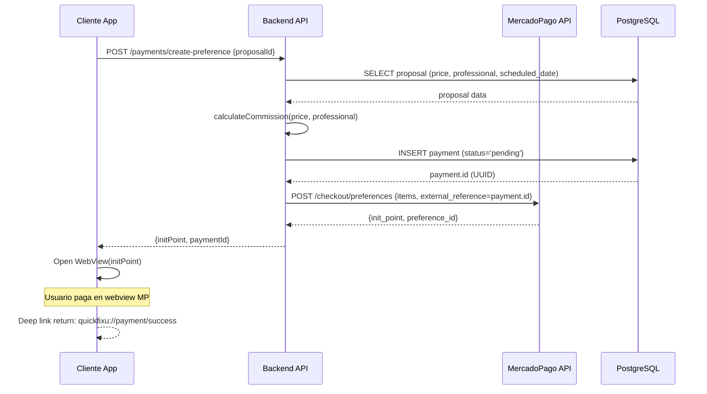
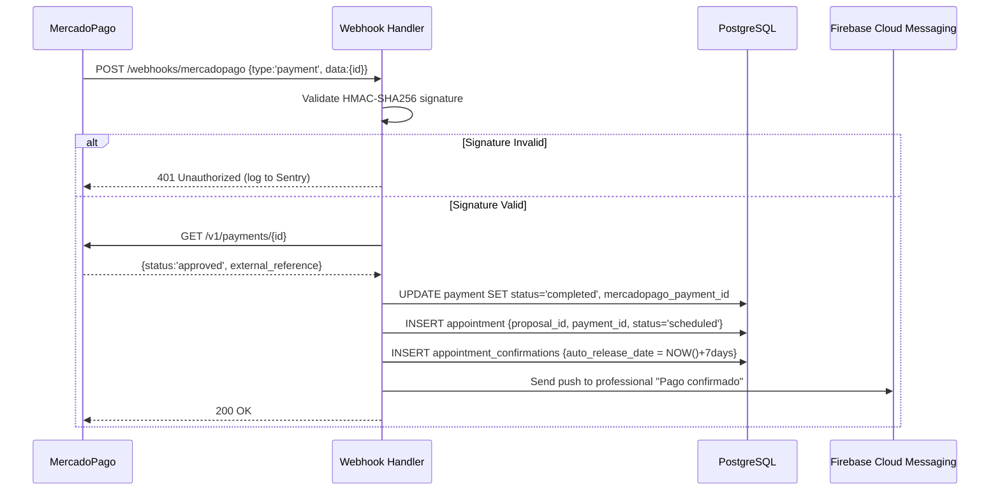
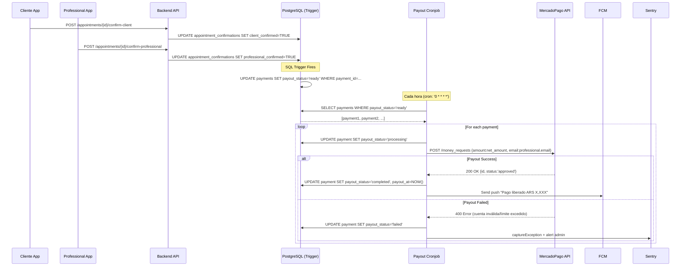
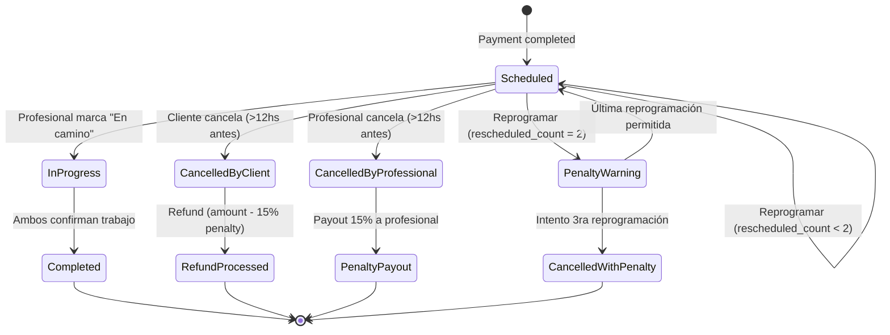

# Design: Fase 4 - Payments & Appointments

> **Historical artifact note (April 2026):** This design was written before the V1 marketplace pivot.
>
> All payment, escrow, commission, refund, payout, and MercadoPago assumptions in this file are **superseded for V1** by:
> - `docs/PRD.md`
> - `docs/FunctionalFlow.md`
> - `docs/BusinessCase.md`
> - `docs/tickets/2026-04-v1-marketplace-pivot.md`
>
> Preserve this document for historical context only.

**Change name:** `fase-4-payments-appointments`  
**Date:** Marzo 2026  
**Status:** Design Complete  
**Prerequisite:** Fase 3 (Chat en Tiempo Real) MUST be completed

---

## Technical Approach

Esta fase implementa el **flujo completo de monetización** del marketplace: desde que el cliente acepta una propuesta hasta que el profesional recibe su pago. La arquitectura se basa en **MercadoPago Checkout Pro** (webview redirect) para cumplir automáticamente PCI compliance, **escrow manual** con confirmación mutua (retención de fondos hasta que ambas partes confirmen trabajo completado), y **state machines** para gestionar appointments con reprogramaciones limitadas y penalizaciones anti-abuse.

**Key Technical Decisions:**
1. **MercadoPago Checkout Pro** → Seguridad PCI automática, UI nativa, 0 mantenimiento frontend de formularios
2. **Manual Payout Post-Confirmación** → Dinero va a cuenta QuickFixU, liberamos con MP API después de confirmación mutua (evita complejidad Marketplace Split Payment para MVP)
3. **Webhook Idempotencia** → UNIQUE constraint en `mercadopago_payment_id` + signature verification HMAC-SHA256
4. **State Machine Appointments** → PostgreSQL triggers actualizan `payment.payout_status='ready'` cuando ambos confirman
5. **Cronjob Architecture** → 3 cronjobs independientes: payout processor (cada hora), auto-release timeout (diario), balance settlement (mensual)

---

## Architecture Decisions

### Decision: Checkout Flow - MercadoPago Checkout Pro vs Checkout API

**Choice**: MercadoPago Checkout Pro (Webview Redirect)

**Alternatives considered**:
- Checkout API (tokenización in-app, formulario custom): Requiere certificación PCI + mantenimiento complejo validaciones, alta barrera entrada MVP

**Rationale**:
- PCI compliance automático (MP maneja datos sensibles, no nosotros)
- UI familiar para usuarios argentinos (mayor confianza en conversión)
- Soporte múltiples métodos pago out-of-the-box (tarjeta, saldo MP, Mercado Crédito, cuotas)
- Testing simple con tarjetas sandbox MP documentadas
- 0 mantenimiento frontend de validación Luhn, regex tarjetas, manejo errores CVV

**Trade-off aceptado**: Usuario sale temporalmente de nuestra app (webview) → Mitigado con deep links seamless de retorno

---

### Decision: Escrow Implementation - Manual Payout vs MP Marketplace Split

**Choice**: Manual Payout (Retener en cuenta QuickFixU, liberar vía API MP después confirmación)

**Alternatives considered**:
- MP Marketplace Split Payment: Requiere profesionales con cuenta MP seller aprobada (proceso burocrático lento, barrera entrada), no permite retención hasta confirmación

**Rationale**:
- Control total sobre cuándo liberar pago (confirmación mutua, timeout 7 días, resolución disputas)
- No requiere aprobación MP Marketplace (simplifica onboarding profesionales)
- Permite payouts parciales (ej: 50% adelanto, 50% post-confirmación - feature futura)
- Auditoría completa (todas transacciones pasan por nuestra cuenta → log unified)

**Trade-off aceptado**: Responsabilidad fiscal mayor (AFIP nos ve como intermediario) → Mitigado con export CSV mensual para contador + cuenta bancaria separada solo para escrow

---

### Decision: Webhook Security - Signature Verification HMAC-SHA256

**Choice**: Validar header `x-signature` con HMAC-SHA256 usando MP webhook secret

**Alternatives considered**:
- Validar solo IP origen: Spoofeable con proxy/VPN, IPs MP pueden cambiar sin aviso
- No validar firma: INACEPTABLE - atacante podría forjar webhooks (marcar payments completed sin pago real)

**Rationale**:
- Única garantía criptográfica que webhook viene de MP (atacante no puede forjar sin secret)
- Estándar industria para webhooks financieros (Stripe, PayPal también usan HMAC)
- Protege contra replay attacks (signature incluye timestamp + request-id)

**Implementation**:
```typescript
const manifest = `id:${req.body.id};request-id:${xRequestId};ts:${ts};`;
const expectedHash = crypto.createHmac('sha256', MP_WEBHOOK_SECRET).update(manifest).digest('hex');
if (hash !== expectedHash) throw new Error('Invalid signature');
```

---

### Decision: Confirmación Mutua - Tabla Separada `appointment_confirmations`

**Choice**: Tabla dedicada con flags `client_confirmed`, `professional_confirmed`, trigger SQL al confirmar ambos

**Alternatives considered**:
- Flags directamente en `appointments`: Contamina tabla con campos no relacionados al estado del trabajo, dificulta agregar más confirmaciones (ej: "materiales pagados", "sitio limpiado")

**Rationale**:
- Separación de concerns (appointments = estado trabajo, confirmations = tracking validación)
- Queries eficientes con índice dedicado en `auto_release_date`
- Escalable (fácil agregar nuevas confirmaciones sin modificar schema appointments)
- Trigger SQL simple:
```sql
CREATE TRIGGER trigger_mutual_confirmation
AFTER UPDATE ON appointment_confirmations
FOR EACH ROW WHEN (client_confirmed = TRUE AND professional_confirmed = TRUE)
EXECUTE FUNCTION handle_mutual_confirmation();
```

---

### Decision: Comisión Variable - Snapshot Inmutable en Payment

**Choice**: Calcular `commission_percentage` al crear payment, guardarlo (NO recalcular nunca)

**Alternatives considered**:
- Calcular en runtime siempre: Histórico inconsistente si reglas cambian (auditoría AFIP imposible, UX confusa)

**Rationale**:
- Histórico inmutable (si reglas comisión cambian, payments viejos mantienen su % original)
- Auditoría AFIP: Podemos demostrar exactamente qué comisión cobramos en cada transacción hace 2 años
- UX transparente: Profesional ve "Comisión 0%" al aceptar → ESO es lo que se cobra (no cambia retroactivamente)

**Implementation**:
```typescript
const { commissionPercentage } = calculateCommission(amount, professional);
await prisma.payment.create({
  data: {
    commission_percentage: commissionPercentage, // Snapshot inmutable
    // ...
  }
});
```

---

### Decision: Auto-Release Timeout - Cronjob Diario vs Event-Driven Queue

**Choice**: Cronjob cada 24 horas busca `appointment_confirmations` con `auto_release_date <= NOW()`

**Alternatives considered**:
- Event-driven con Bull queue (delayed jobs 7 días): Overkill para MVP, complejidad Redis + queue monitoring, risk si Redis cae (jobs perdidos)

**Rationale**:
- Standard industria para timeouts no-críticos (Airbnb, Uber usan cronjobs para auto-confirm)
- Latencia aceptable (hasta 24hs) vs complejidad (cronjob = 1 query simple)
- Debuggeable: Logs claros de qué appointments auto-released cada día

**Trade-off aceptado**: Latencia hasta 24hs → Mitigado con notificaciones preventivas días 5, 6, 7 ("Confirma trabajo o se liberará automáticamente")

---

## Data Flow

### 1. Payment Creation Flow (Cliente Acepta Propuesta)



---

### 2. Webhook Processing Flow (MP Notifica Pago Aprobado)



---

### 3. Mutual Confirmation + Payout Flow



---

### 4. Reprogramación + Penalización Flow



---

## File Changes

| File | Action | Description |
|------|--------|-------------|
| `prisma/schema.prisma` | Modify | Agregar tablas: `payments`, `appointment_confirmations`, `balances`, `disputes`, `refunds`. Agregar campos: `appointments.payment_id`, `appointments.rescheduled_count`, `appointments.penalty_applied`, `professionals.credit_card_token` |
| `prisma/migrations/20260322_create_payments_appointments.sql` | Create | Migration SQL completa (ver sección Database Schema) |
| `src/routes/payments.routes.ts` | Create | Rutas: `POST /create-preference`, `POST /create-cash-payment`, `POST /webhooks/mercadopago` |
| `src/controllers/payments.controller.ts` | Create | Lógica crear preferencia MP, calcular comisión, webhook handler con signature verification |
| `src/routes/appointments.routes.ts` | Create | Rutas: `POST /{id}/confirm`, `POST /{id}/reschedule`, `POST /{id}/cancel` |
| `src/controllers/appointments.controller.ts` | Create | Lógica confirmación mutua, reprogramaciones (validar count <= 2), cancelaciones con penalty |
| `src/services/mercadopago.service.ts` | Create | Wrapper SDK MP: `createPreference()`, `validateWebhookSignature()`, `processPayout()`, `createRefund()` |
| `src/services/commission.service.ts` | Create | `calculateCommission(amount, professional)` → retorna {commissionPercentage, commissionAmount, netAmount} |
| `src/cronjobs/payout-processor.cron.ts` | Create | Cronjob cada hora: busca `payments.payout_status='ready'`, hace payout MP, actualiza status |
| `src/cronjobs/auto-release.cron.ts` | Create | Cronjob diario: busca `appointment_confirmations.auto_release_date <= NOW()`, auto-confirma cliente |
| `src/cronjobs/balance-settlement.cron.ts` | Create | Cronjob mensual (día 1): cobra deudas `balances.balance < 0` con tarjeta profesional |
| `src/utils/webhook-signature.ts` | Create | `validateMercadoPagoSignature(signature, requestId, body, secret)` |
| `src/config/mercadopago.config.ts` | Create | Inicializar SDK MP con `access_token` desde env |
| `.env.example` | Modify | Agregar: `MP_ACCESS_TOKEN`, `MP_WEBHOOK_SECRET`, `USE_SANDBOX` |
| `src/types/payments.types.ts` | Create | TypeScript types: `Payment`, `AppointmentConfirmation`, `Balance`, `PayoutStatus`, `CommissionCalculation` |
| `tests/integration/payments.test.ts` | Create | Tests E2E: crear preferencia → mock webhook → verificar appointment creado → confirmar mutuo → mock payout |
| `tests/unit/commission.service.test.ts` | Create | Tests unitarios: profesional sin tarjeta=50%, con tarjeta <1año=0%, con tarjeta >1año=10% |
| `tests/unit/webhook-signature.test.ts` | Create | Tests signature verification: valid signature OK, invalid signature reject, missing headers reject |
| `docs/api/payments.swagger.yaml` | Create | Swagger docs rutas payments y appointments |

---

## Interfaces / Contracts

### 1. MercadoPago Preference Creation Request

```typescript
interface CreatePreferenceRequest {
  proposalId: number; // Propuesta aceptada
}

interface CreatePreferenceResponse {
  preferenceId: string; // MP preference ID
  initPoint: string; // URL webview producción
  sandboxInitPoint: string; // URL webview sandbox
  paymentId: string; // UUID nuestro payment
}

// Backend implementation
async function createPreference(req: Request, res: Response) {
  const { proposalId } = req.body;
  const userId = req.userId; // from JWT middleware
  
  const proposal = await prisma.proposal.findFirst({
    where: { id: proposalId, status: 'accepted' },
    include: { 
      post: { include: { user: true } },
      professional: { include: { user: true } }
    }
  });
  
  if (!proposal || proposal.post.user_id !== userId) {
    return res.status(403).json({ error: 'Access denied' });
  }
  
  const { commissionPercentage, commissionAmount, netAmount } = 
    calculateCommission(proposal.price, proposal.professional);
  
  const payment = await prisma.payment.create({
    data: {
      proposal_id: proposalId,
      client_id: userId,
      professional_id: proposal.professional.user_id,
      amount: proposal.price,
      commission_percentage: commissionPercentage,
      commission_amount: commissionAmount,
      net_amount: netAmount,
      payment_method: 'mercadopago',
      status: 'pending'
    }
  });
  
  const preference = await mercadopago.preferences.create({
    items: [{
      title: `Trabajo: ${proposal.post.title}`,
      unit_price: parseFloat(proposal.price),
      quantity: 1
    }],
    payer: {
      email: proposal.post.user.email,
      name: proposal.post.user.full_name
    },
    back_urls: {
      success: 'quickfixu://payment/success',
      failure: 'quickfixu://payment/failure',
      pending: 'quickfixu://payment/pending'
    },
    auto_return: 'approved',
    external_reference: payment.id, // UUID payment
    notification_url: `${API_URL}/webhooks/mercadopago`
  });
  
  res.json({
    preferenceId: preference.body.id,
    initPoint: preference.body.init_point,
    sandboxInitPoint: preference.body.sandbox_init_point,
    paymentId: payment.id
  });
}
```

---

### 2. Webhook Handler (MP IPN)

```typescript
interface MercadoPagoWebhook {
  action: string; // 'payment.created' | 'payment.updated'
  type: string; // 'payment'
  data: {
    id: string; // mercadopago_payment_id
  };
}

async function handleMercadoPagoWebhook(req: Request, res: Response) {
  try {
    // 1. Validate signature
    const signature = req.headers['x-signature'] as string;
    const xRequestId = req.headers['x-request-id'] as string;
    
    if (!validateMercadoPagoSignature(signature, xRequestId, req.body, MP_WEBHOOK_SECRET)) {
      logger.warn('Invalid webhook signature', { ip: req.ip });
      return res.status(401).json({ error: 'Invalid signature' });
    }
    
    // 2. Extract payment ID
    const { type, data } = req.body;
    if (type !== 'payment') {
      return res.status(200).json({ message: 'Ignored non-payment webhook' });
    }
    
    const mpPaymentId = data.id;
    
    // 3. Fetch payment details from MP API (don't trust webhook body only)
    const mpPayment = await mercadopago.payment.get(mpPaymentId);
    const paymentData = mpPayment.body;
    
    // 4. Find payment in our DB by external_reference
    const externalReference = paymentData.external_reference; // UUID
    const payment = await prisma.payment.findUnique({
      where: { id: externalReference }
    });
    
    if (!payment) {
      logger.error('Payment not found in DB', { externalReference });
      return res.status(404).json({ error: 'Payment not found' });
    }
    
    // 5. Update payment status (IDEMPOTENT thanks to WHERE unique)
    const newStatus = mapMPStatusToOurStatus(paymentData.status);
    
    await prisma.payment.update({
      where: { id: payment.id },
      data: {
        mercadopago_payment_id: mpPaymentId,
        status: newStatus,
        updated_at: new Date()
      }
    });
    
    // 6. Create appointment if payment completed
    if (newStatus === 'completed') {
      await createAppointmentFromPayment(payment.id);
    }
    
    res.status(200).json({ message: 'Webhook processed' });
  } catch (error) {
    logger.error('Webhook processing error', error);
    Sentry.captureException(error);
    res.status(500).json({ error: 'Internal error' });
  }
}

function mapMPStatusToOurStatus(mpStatus: string): string {
  switch (mpStatus) {
    case 'approved': return 'completed';
    case 'pending':
    case 'in_process':
    case 'in_mediation': return 'pending';
    case 'rejected':
    case 'cancelled': return 'failed';
    case 'refunded':
    case 'charged_back': return 'refunded';
    default: return 'pending';
  }
}
```

---

### 3. Commission Calculation

```typescript
interface CommissionCalculation {
  commissionPercentage: number; // 0 | 10 | 50
  commissionAmount: number; // ARS
  netAmount: number; // ARS (amount - commission - penalty)
}

function calculateCommission(
  amount: number,
  professional: Professional
): CommissionCalculation {
  let commissionPercentage = 10; // Default: 10%
  
  if (professional.credit_card_token) {
    const oneYearAgo = new Date();
    oneYearAgo.setFullYear(oneYearAgo.getFullYear() - 1);
    
    if (professional.created_at > oneYearAgo) {
      commissionPercentage = 0; // Promoción primer año
    }
  } else {
    commissionPercentage = 50; // Sin tarjeta = 50% (desincentivar)
  }
  
  const commissionAmount = (amount * commissionPercentage) / 100;
  const netAmount = amount - commissionAmount;
  
  return { commissionPercentage, commissionAmount, netAmount };
}
```

---

### 4. Appointment Confirmation

```typescript
interface ConfirmAppointmentRequest {
  appointmentId: number;
  role: 'client' | 'professional';
}

async function confirmAppointment(req: Request, res: Response) {
  const { appointmentId } = req.params;
  const userId = req.userId; // from JWT
  
  const appointment = await prisma.appointment.findUnique({
    where: { id: parseInt(appointmentId) },
    include: {
      proposal: {
        include: {
          post: true,
          professional: { include: { user: true } }
        }
      },
      confirmation: true
    }
  });
  
  if (!appointment) {
    return res.status(404).json({ error: 'Appointment not found' });
  }
  
  // Determine role
  const isClient = appointment.proposal.post.user_id === userId;
  const isProfessional = appointment.proposal.professional.user_id === userId;
  
  if (!isClient && !isProfessional) {
    return res.status(403).json({ error: 'Access denied' });
  }
  
  // Update confirmation
  const updateData = isClient 
    ? { client_confirmed: true, client_confirmed_at: new Date() }
    : { professional_confirmed: true, professional_confirmed_at: new Date() };
  
  await prisma.appointmentConfirmation.update({
    where: { appointment_id: appointment.id },
    data: updateData
  });
  
  // Trigger will handle payment.payout_status='ready' if both confirmed
  
  // Notify other party
  const otherUserId = isClient 
    ? appointment.proposal.professional.user_id 
    : appointment.proposal.post.user_id;
  
  await sendPushNotification(otherUserId, {
    title: isClient ? 'Cliente confirmó trabajo' : 'Profesional confirmó trabajo',
    body: 'Solo falta tu confirmación para liberar el pago',
    data: { type: 'appointment_confirmation', appointmentId: appointment.id }
  });
  
  res.json({ message: 'Confirmation registered' });
}
```

---

### 5. Payout Cronjob

```typescript
// Cronjob: Cada hora ('0 * * * *')
async function processReadyPayouts() {
  const readyPayments = await prisma.payment.findMany({
    where: {
      payout_status: 'ready',
      status: 'completed',
      payment_method: 'mercadopago' // Solo MP (cash no usa payout)
    },
    include: {
      professional: { include: { user: true } }
    }
  });
  
  logger.info(`Found ${readyPayments.length} payments ready for payout`);
  
  for (const payment of readyPayments) {
    try {
      // Lock: update to 'processing' to avoid double-processing
      await prisma.payment.update({
        where: { id: payment.id },
        data: { payout_status: 'processing' }
      });
      
      // Payout via MercadoPago API
      const payout = await mercadopago.money_requests.create({
        amount: parseFloat(payment.net_amount),
        email: payment.professional.user.email,
        concept: 'Pago por trabajo completado',
        currency_id: 'ARS'
      });
      
      // Success
      await prisma.payment.update({
        where: { id: payment.id },
        data: {
          payout_status: 'completed',
          payout_at: new Date()
        }
      });
      
      await sendPushNotification(payment.professional.user_id, {
        title: '💸 Pago liberado',
        body: `Recibiste ARS ${payment.net_amount} por trabajo completado`,
        data: { type: 'payout_completed', paymentId: payment.id }
      });
      
      logger.info('Payout successful', { paymentId: payment.id, amount: payment.net_amount });
    } catch (error) {
      // Payout failed (cuenta inválida, límite excedido, etc.)
      await prisma.payment.update({
        where: { id: payment.id },
        data: { payout_status: 'failed' }
      });
      
      Sentry.captureException(error, {
        tags: { payment_id: payment.id },
        extra: { professional_email: payment.professional.user.email }
      });
      
      logger.error('Payout failed', { paymentId: payment.id, error });
    }
  }
}
```

---

## Database Schema (Prisma)

### Nuevas Tablas y Campos

```prisma
// prisma/schema.prisma

model Payment {
  id                     String   @id @default(uuid()) @db.Uuid
  proposal_id            Int?
  client_id              Int
  professional_id        Int
  
  // Montos
  amount                 Decimal  @db.Decimal(10, 2)
  commission_percentage  Decimal  @db.Decimal(5, 2)
  commission_amount      Decimal  @db.Decimal(10, 2)
  net_amount             Decimal  @db.Decimal(10, 2)
  penalty_amount         Decimal  @default(0) @db.Decimal(10, 2)
  penalty_reason         String?  @db.VarChar(100)
  
  // Método pago
  payment_method         String   @db.VarChar(20) // 'mercadopago' | 'cash'
  mercadopago_payment_id String?  @unique @db.VarChar(100)
  currency               String   @default("ARS") @db.VarChar(3)
  
  // Estados
  status                 String   @default("pending") @db.VarChar(20) // 'pending' | 'completed' | 'failed' | 'refunded' | 'disputed'
  payout_status          String   @default("pending") @db.VarChar(20) // 'pending' | 'ready' | 'processing' | 'completed' | 'failed'
  payout_at              DateTime?
  
  created_at             DateTime @default(now())
  updated_at             DateTime @updatedAt
  
  // Relations
  proposal               Proposal?     @relation(fields: [proposal_id], references: [id], onDelete: Restrict)
  client                 User          @relation("ClientPayments", fields: [client_id], references: [id], onDelete: Restrict)
  professional           User          @relation("ProfessionalPayments", fields: [professional_id], references: [id], onDelete: Restrict)
  appointment            Appointment?
  refunds                Refund[]
  
  @@index([proposal_id])
  @@index([client_id])
  @@index([professional_id])
  @@index([status])
  @@index([payout_status], where: { payout_status: { in: ["ready", "processing"] } })
  @@map("payments")
}

model Appointment {
  id                  Int      @id @default(autoincrement())
  proposal_id         Int      @unique
  payment_id          String   @unique @db.Uuid
  
  // Fecha/hora (puede cambiar por reprogramaciones)
  scheduled_date      DateTime @db.Date
  scheduled_time      DateTime @db.Time
  
  // Estados
  status              String   @default("scheduled") @db.VarChar(30)
  // 'scheduled' | 'in_progress' | 'completed' | 'cancelled_by_client' | 'cancelled_by_professional'
  
  // Reprogramaciones
  rescheduled_count   Int      @default(0)
  last_reschedule_reason String? @db.Text
  
  // Cancelaciones
  cancellation_reason String?  @db.Text
  cancelled_by        String?  @db.VarChar(20) // 'client' | 'professional'
  penalty_applied     Boolean  @default(false)
  
  created_at          DateTime @default(now())
  updated_at          DateTime @updatedAt
  
  // Relations
  proposal            Proposal              @relation(fields: [proposal_id], references: [id], onDelete: Restrict)
  payment             Payment               @relation(fields: [payment_id], references: [id], onDelete: Restrict)
  confirmation        AppointmentConfirmation?
  disputes            Dispute[]
  
  @@index([proposal_id])
  @@index([payment_id])
  @@index([status])
  @@index([scheduled_date])
  @@map("appointments")
}

model AppointmentConfirmation {
  id                       Int       @id @default(autoincrement())
  appointment_id           Int       @unique
  
  client_confirmed         Boolean   @default(false)
  client_confirmed_at      DateTime?
  professional_confirmed   Boolean   @default(false)
  professional_confirmed_at DateTime?
  
  auto_release_date        DateTime  // scheduled_date + 7 días
  auto_released            Boolean   @default(false)
  
  created_at               DateTime  @default(now())
  updated_at               DateTime  @updatedAt
  
  // Relations
  appointment              Appointment @relation(fields: [appointment_id], references: [id], onDelete: Cascade)
  
  @@index([appointment_id])
  @@index([auto_release_date], where: { client_confirmed: false })
  @@map("appointment_confirmations")
}

model Balance {
  id                    Int       @id @default(autoincrement())
  professional_id       Int       @unique
  
  balance               Decimal   @default(0) @db.Decimal(10, 2) // Negativo = deuda
  last_settlement_date  DateTime?
  last_settlement_amount Decimal? @db.Decimal(10, 2)
  
  created_at            DateTime  @default(now())
  updated_at            DateTime  @updatedAt
  
  // Relations
  professional          Professional @relation(fields: [professional_id], references: [id], onDelete: Restrict)
  
  @@index([professional_id])
  @@index([balance], where: { balance: { lt: 0 } })
  @@map("balances")
}

model Dispute {
  id                  Int       @id @default(autoincrement())
  appointment_id      Int
  reporter_id         Int
  
  reason              String    @db.Text
  evidence_urls       String[]  // Array URLs fotos
  
  status              String    @default("open") @db.VarChar(20)
  // 'open' | 'investigating' | 'resolved_refund' | 'resolved_payout' | 'resolved_split' | 'closed_no_action'
  
  admin_notes         String?   @db.Text
  resolved_at         DateTime?
  resolution_reason   String?   @db.Text
  
  created_at          DateTime  @default(now())
  updated_at          DateTime  @updatedAt
  
  // Relations
  appointment         Appointment @relation(fields: [appointment_id], references: [id], onDelete: Restrict)
  reporter            User        @relation(fields: [reporter_id], references: [id], onDelete: Restrict)
  
  @@index([appointment_id])
  @@index([status], where: { status: { in: ["open", "investigating"] } })
  @@index([created_at(sort: Desc)])
  @@map("disputes")
}

model Refund {
  id                    Int       @id @default(autoincrement())
  payment_id            String    @db.Uuid
  
  amount                Decimal   @db.Decimal(10, 2)
  reason                String    @db.VarChar(100)
  // 'dispute_resolved' | 'cancellation_early' | 'technical_error'
  
  mercadopago_refund_id String?   @unique @db.VarChar(100)
  status                String    @default("pending") @db.VarChar(20)
  // 'pending' | 'completed' | 'failed'
  
  created_at            DateTime  @default(now())
  completed_at          DateTime?
  
  // Relations
  payment               Payment   @relation(fields: [payment_id], references: [id], onDelete: Restrict)
  
  @@index([payment_id])
  @@index([status])
  @@map("refunds")
}

// Modificar modelo existente Professional
model Professional {
  // ... campos existentes
  credit_card_token  String?  @db.VarChar(255) // Token MP para cobro comisiones cash
  // ... resto campos
  
  balance            Balance?
}
```

---

### SQL Trigger: Mutual Confirmation → Payout Ready

```sql
-- Migration: 20260322_create_mutual_confirmation_trigger.sql

CREATE OR REPLACE FUNCTION handle_mutual_confirmation()
RETURNS TRIGGER AS $$
BEGIN
  -- Solo ejecutar si AMBOS confirmaron
  IF NEW.client_confirmed = TRUE AND NEW.professional_confirmed = TRUE THEN
    UPDATE payments
    SET payout_status = 'ready',
        updated_at = NOW()
    WHERE id = (
      SELECT payment_id 
      FROM appointments 
      WHERE id = NEW.appointment_id
    )
    AND payout_status = 'pending'; -- Evitar re-ejecutar si ya procesado
  END IF;
  
  RETURN NEW;
END;
$$ LANGUAGE plpgsql;

CREATE TRIGGER trigger_mutual_confirmation
AFTER UPDATE ON appointment_confirmations
FOR EACH ROW
WHEN (NEW.client_confirmed = TRUE AND NEW.professional_confirmed = TRUE)
EXECUTE FUNCTION handle_mutual_confirmation();
```

---

## Testing Strategy

### Unit Tests

| Layer | What to Test | Approach |
|-------|-------------|----------|
| Commission Calculation | Sin tarjeta → 50%, Con tarjeta <1 año → 0%, Con tarjeta >1 año → 10% | Jest unit tests con mocks de profesional (created_at, credit_card_token) |
| Webhook Signature | Valid signature → accept, Invalid → reject, Missing headers → reject | Jest unit con ejemplos firma real MP (documentación oficial) |
| Status Mapping | MP status 'approved' → 'completed', 'rejected' → 'failed', etc. | Jest unit con todos casos MP |

```typescript
// tests/unit/commission.service.test.ts
describe('calculateCommission', () => {
  it('should return 50% for professional without card', () => {
    const professional = { credit_card_token: null, created_at: new Date() };
    const result = calculateCommission(10000, professional);
    expect(result.commissionPercentage).toBe(50);
    expect(result.commissionAmount).toBe(5000);
    expect(result.netAmount).toBe(5000);
  });
  
  it('should return 0% for professional with card <1 year', () => {
    const professional = {
      credit_card_token: 'mp_token_abc',
      created_at: new Date(Date.now() - 6 * 30 * 24 * 60 * 60 * 1000) // 6 meses
    };
    const result = calculateCommission(10000, professional);
    expect(result.commissionPercentage).toBe(0);
    expect(result.commissionAmount).toBe(0);
    expect(result.netAmount).toBe(10000);
  });
  
  it('should return 10% for professional with card >1 year', () => {
    const professional = {
      credit_card_token: 'mp_token_abc',
      created_at: new Date(Date.now() - 14 * 30 * 24 * 60 * 60 * 1000) // 14 meses
    };
    const result = calculateCommission(10000, professional);
    expect(result.commissionPercentage).toBe(10);
    expect(result.commissionAmount).toBe(1000);
    expect(result.netAmount).toBe(9000);
  });
});
```

---

### Integration Tests

| Layer | What to Test | Approach |
|-------|-------------|----------|
| Payment Flow E2E | Crear preferencia → Mock webhook approved → Verificar payment.status='completed' + appointment creado | Supertest + nock (mock MP API), SQLite in-memory |
| Confirmation Mutua | Cliente confirma → Profesional confirma → Verificar payment.payout_status='ready' (trigger SQL) | Supertest + real PostgreSQL test DB |
| Payout Cronjob | Insert payment con payout_status='ready' → Run cronjob → Mock MP payout API → Verificar payout_status='completed' | Jest + nock + test DB |

```typescript
// tests/integration/payments.test.ts
describe('Payment Flow E2E', () => {
  beforeEach(async () => {
    await resetTestDatabase();
    await seedTestData(); // user, professional, post, proposal accepted
  });
  
  it('should create payment, process webhook, and create appointment', async () => {
    // 1. Create preference
    const res1 = await request(app)
      .post('/api/payments/create-preference')
      .set('Authorization', `Bearer ${clientToken}`)
      .send({ proposalId: 1 });
    
    expect(res1.status).toBe(200);
    expect(res1.body).toHaveProperty('initPoint');
    const paymentId = res1.body.paymentId;
    
    // 2. Mock webhook (simulate MP approved)
    const webhookPayload = {
      type: 'payment',
      data: { id: 'mp_12345' }
    };
    
    // Mock MP API call GET /v1/payments/mp_12345
    nock('https://api.mercadopago.com')
      .get('/v1/payments/mp_12345')
      .reply(200, {
        id: 'mp_12345',
        status: 'approved',
        external_reference: paymentId
      });
    
    const res2 = await request(app)
      .post('/api/webhooks/mercadopago')
      .set('x-signature', validSignature) // Mock valid signature
      .set('x-request-id', 'req_123')
      .send(webhookPayload);
    
    expect(res2.status).toBe(200);
    
    // 3. Verify payment updated
    const payment = await prisma.payment.findUnique({ where: { id: paymentId } });
    expect(payment.status).toBe('completed');
    expect(payment.mercadopago_payment_id).toBe('mp_12345');
    
    // 4. Verify appointment created
    const appointment = await prisma.appointment.findUnique({
      where: { payment_id: paymentId }
    });
    expect(appointment).not.toBeNull();
    expect(appointment.status).toBe('scheduled');
    
    // 5. Verify confirmation record created
    const confirmation = await prisma.appointmentConfirmation.findUnique({
      where: { appointment_id: appointment.id }
    });
    expect(confirmation).not.toBeNull();
    expect(confirmation.auto_release_date).toBeGreaterThan(new Date());
  });
});
```

---

### E2E Tests (Sandbox MercadoPago)

| Layer | What to Test | Approach |
|-------|-------------|----------|
| Real MP Checkout | Crear preferencia real con credenciales TEST → Abrir webview sandbox → Pagar con tarjeta de prueba MP → Verificar webhook real | Cypress E2E con credenciales `TEST-xxx`, tarjeta prueba `4509 9535 6623 3704` |

**Tarjetas de prueba MP (sandbox):**
- Visa aprobada: `4509 9535 6623 3704` (CVV: 123, Exp: 11/25)
- Mastercard rechazada: `5031 7557 3453 0604` (CVV: 123, Exp: 11/25)

```javascript
// cypress/e2e/payment-flow.cy.js
describe('MercadoPago Payment Flow (Sandbox)', () => {
  it('should complete payment with test card', () => {
    cy.login('cliente@test.com', 'password');
    cy.visit('/proposals/1'); // Propuesta aceptada
    cy.contains('Pagar con MercadoPago').click();
    
    // Webview abre (interceptamos URL)
    cy.url().should('include', 'mercadopago.com/checkout');
    
    // Completar formulario MP con tarjeta de prueba
    cy.get('#cardNumber').type('4509953566233704');
    cy.get('#cvv').type('123');
    cy.get('#expirationMonth').select('11');
    cy.get('#expirationYear').select('25');
    cy.get('#submit').click();
    
    // Redirige a deep link success
    cy.url().should('include', 'quickfixu://payment/success');
    
    // Verificar appointment creado en app
    cy.visit('/appointments');
    cy.contains('Trabajo agendado').should('be.visible');
  });
});
```

---

## Migration / Rollout

### Fase 4 Rollout Plan

**Pre-requisitos:**
1. ✅ Fase 3 (Chat) completada y en producción
2. ✅ Credenciales MercadoPago obtenidas (TEST para sandbox, PROD para producción)
3. ✅ Cuenta bancaria separada para escrow configurada

**Rollout Steps:**

1. **Development (Semana 1-2)**
   - Ejecutar migrations Prisma (tablas nuevas)
   - Implementar rutas + controllers payments/appointments
   - Configurar webhooks MP apuntando a ngrok local (development)
   - Testing unitarios + integración (100% coverage critical paths)

2. **Staging (Semana 3)**
   - Deploy staging con credenciales TEST MP
   - Feature flag `USE_SANDBOX=true`
   - E2E testing con tarjetas de prueba MP
   - Validar webhooks reales sandbox (verificar idempotencia + signature)

3. **Production Canary (Semana 4)**
   - Deploy producción con feature flag `PAYMENTS_ENABLED=false` (disabled para users)
   - Habilitar solo para 5 profesionales beta-testers
   - Monitorear logs Sentry, Datadog
   - Validar webhooks producción con pagos reales pequeños (ARS 100)

4. **Production Full Rollout (Semana 5)**
   - Feature flag `PAYMENTS_ENABLED=true` para todos users
   - Monitoreo 24/7 primeras 72hs (on-call engineer)
   - Alert si webhook signature inválido (potencial ataque)
   - Backup BD cada 6hs primeros 7 días

**Rollback Plan:**
- Feature flag `PAYMENTS_ENABLED=false` → Usuarios ven mensaje "Pagos temporalmente deshabilitados"
- Payments creados ANTES de rollback se procesan normalmente (no bloqueamos payouts)
- Si migrations fallan: Restore BD desde backup pre-migration

---

## Open Questions

1. **¿Qué hacer si MP rechaza payout porque profesional no tiene cuenta MP?**
   - **Propuesta**: Notificar profesional vía push + email "Configura cuenta MP para recibir pagos". Guardar payout_status='pending_account'. Admin puede hacer transferencia bancaria manual mientras tanto.

2. **¿Límite máximo de deuda en balances antes de bloquear profesional?**
   - **Propuesta**: ARS 20,000 (suficiente para ~2-3 trabajos promedio). Si `balance < -20000`, bloquear aceptar nuevos trabajos hasta regularizar.

3. **¿Qué pasa si cliente disputa después de auto-release (pago ya liberado a profesional)?**
   - **Propuesta**: Botón "Reportar problema" se bloquea después de payout_at (grayed out, tooltip "Contacta soporte"). Soporte puede iniciar refund manual desde panel admin.

4. **¿Cómo manejar cambios retroactivos en reglas comisión (ej: gobierno exige 15% mínimo)?**
   - **Propuesta**: Snapshot inmutable en payment garantiza histórico correcto. Nuevas reglas aplican solo a payments NUEVOS (created_at > fecha cambio). Migración manual si necesario.

5. **¿Timeout auto-release debe notificar con cuánta anticipación?**
   - **Propuesta**: Notificaciones días 5, 6, 7 ("Tienes X días para confirmar trabajo"). Configurar como env var `AUTO_RELEASE_NOTIFICATION_DAYS=[5,6,7]` (fácil ajustar según feedback users).

---

**Next Step**: Ready for tasks (sdd-tasks). El diseño técnico está completo y validado contra exploration + data model existente.
