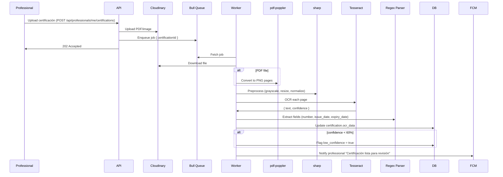

# Proposal: Fase 6 - Admin Panel & OCR Certification Validation

**Change:** `fase-6-admin-ocr`  
**Date:** Marzo 2026  
**Status:** Proposed  
**Prerequisites:** Fase 4 (Payments & Appointments) COMPLETE, Fase 5 (Reviews) optional

---

## Intent

QuickFixU CANNOT operate at scale without this phase. Currently:
- **Certifications validated manually in Prisma Studio** — bottleneck that blocks professional onboarding
- **Disputes resolved via email/WhatsApp** — operational chaos, no SLA tracking, poor UX
- **Zero operational visibility** — no GMV metrics, conversion funnels, or business intelligence
- **Content moderation non-existent** — reported posts/profiles handled manually, legal risk

This phase delivers **two critical business pillars**:
1. **Admin Panel** — React.js dashboard for operational management at scale
2. **OCR Pipeline** — Automated certification validation with Tesseract.js + manual fallback

Without these, QuickFixU remains a prototype unable to handle >50 professionals or >100 transactions/month.

---

## Scope

### In Scope

**Bloque 1: Admin Panel Base**
- React.js app (`/admin-panel`) with Material-UI + React Query
- Admin auth: separate `admins` table, JWT with `role: 'admin'`, super admin flag
- Sidebar navigation: Dashboard, Users, Professionals, Certifications, Disputes, Payments, Reports, Logs

**Bloque 2: Dashboard Analytics**
- KPI cards: Total users, active professionals, monthly GMV, transactions
- Charts: Registrations/day, transactions/day, GMV/day (últimos 30 días)
- Top 5 professionals (most jobs, best ratings ≥20 reviews)
- Conversion funnel: Registrations → Posts → Proposals → Payments → Completed
- SQL queries cached in Redis (TTL 5min)

**Bloque 3: OCR Certification Pipeline**
- Bull + Redis queue: `process-certification-ocr` job on upload
- Worker: PDF → Poppler PNG → sharp preprocessing → Tesseract.js (spa language)
- Preprocessing: grayscale, resize 2000px, normalize contrast, sharpen
- Regex parsing via `certification_patterns` table (gasista, electricista, plomero)
- Auto-flag low confidence (<60%) in admin UI
- Retry 3x on Tesseract timeout/error

**Bloque 4: Certification Management**
- Queue view: pending certifications (oldest first)
- Detail view: image (left) + OCR data editable (right)
- Admin approve/reject with reason, updates `professionals.is_verified`
- FCM push notifications: "Certificación aprobada" / "Rechazada. Motivo: [X]"

**Bloque 5: Dispute Resolution**
- List disputes (`open`, `investigating`) with SLA badges (<48h)
- Detail view: appointment info, payment details, chat history, evidence photos
- Action buttons: Refund Total, Refund Parcial, Payout Profesional, Cerrar sin acción
- Backend executes MP API refund/payout, updates dispute status, logs action, notifies users

**Bloque 6: User Management**
- Paginated users (50/page, cursor-based)
- Filters: role, status, fecha registro. Search: nombre, email, DNI (pg_trgm)
- Detail: profile + transaction history + reviews received
- Block/unblock user (super admin only unblock), FCM notification "Cuenta suspendida. Motivo: [X]"

**Bloque 7: Content Moderation**
- `content_reports` table (reporter, entity_type, entity_id, reason, status)
- Mobile endpoint `POST /api/reports/create`
- Admin queue: reported posts/profiles with buttons: Delete Content, Block User, Dismiss Report

**Bloque 8: Logs & Monitoring**
- `admin_actions` table: admin_id, action_type, entity_type, entity_id, details (JSONB), timestamp
- Filterable logs: admin, action, entity, fecha. Export CSV
- Webhook logs: últimos 100 MP webhooks (request body, signature validation, response)

### Out of Scope (Post-MVF)

- MFA admin (password strength + rate limiting sufficient for MVP)
- AI content moderation (Cloudinary AI Moderation $49/mo post-PMF)
- Real-time analytics dashboard (5min cache acceptable)
- Advanced OCR morphological operations (sharp basic preprocessing covers 80% cases)
- Hard delete users (soft delete only — `is_active = false`)
- Admin panel mobile version (desktop-only)

---

## Approach

### Architecture

**Frontend: React.js Web App**
```
admin-panel/
├── src/
│   ├── pages/
│   │   ├── Dashboard.tsx
│   │   ├── Certifications.tsx
│   │   ├── Disputes.tsx
│   │   └── Users.tsx
│   ├── components/Sidebar.tsx
│   ├── api/client.ts (axios + JWT)
│   └── App.tsx
├── package.json
└── vite.config.ts
```

**Stack:**
- React 18 + TypeScript + Vite
- Material-UI v5 (components enterprise-grade)
- React Query (state management API calls)
- Recharts (analytics charts)
- React Hook Form + Zod (validation)

**Backend: Node.js + Express**
```
backend/src/
├── routes/admin/
│   ├── auth.ts (login)
│   ├── analytics.ts (dashboard KPIs)
│   ├── certifications.ts (CRUD)
│   ├── disputes.ts (refund/payout)
│   ├── users.ts (block/unblock)
│   └── logs.ts (admin actions)
├── services/
│   ├── ocr.service.ts (Tesseract + sharp pipeline)
│   └── pdf.service.ts (PDF → PNG conversion)
├── middleware/requireAdmin.ts
└── workers/ocr.worker.ts (Bull queue)
```

**Stack:**
- Tesseract.js v5 (OCR engine)
- sharp (image preprocessing)
- pdf-poppler (PDF → PNG)
- Bull + Redis (async queue)
- bcrypt cost 12 (admin passwords)

### OCR Pipeline Flow



### Security

| Layer | Measure |
|-------|---------|
| Admin auth | Separate `admins` table, JWT `role: 'admin'`, super admin flag |
| Login | Rate limit 5 attempts/10min, password min 12 chars, bcrypt cost 12 |
| Refund idempotency | `WHERE dispute.status = 'investigating'` — prevents double refund |
| Audit trail | `admin_actions` table logs every approve/reject/refund/ban |
| Privilege escalation | `users.id` ≠ `admins.id` (separate tables) |

### Sprint Plan (6 sprints, 100 horas)

| Sprint | Scope | Hours |
|--------|-------|-------|
| 1 | Admin auth + dashboard analytics + tabla admins | 20h |
| 2 | OCR pipeline (Tesseract + Bull queue + preprocessing) | 25h |
| 3 | Gestión certificaciones (lista pending + detail + approve/reject) | 20h |
| 4 | Gestión disputas (lista + detail + refund/payout) | 15h |
| 5 | Gestión usuarios + content reports | 10h |
| 6 | Logs admin actions + webhook logs | 10h |

**Timeline:** 2.5 semanas (2 devs full-time) o 5 semanas (1 dev)

---

## Affected Areas

| Area | Impact | Description |
|------|--------|-------------|
| **New: `admin-panel/`** | New | React.js web app (separate from mobile-app) |
| **New: `backend/routes/admin/`** | New | 8 admin endpoints: auth, analytics, certifications, disputes, users, payments, reports, logs |
| **New: `backend/services/ocr.service.ts`** | New | Tesseract.js + sharp + pdf-poppler pipeline |
| **New: `backend/workers/ocr.worker.ts`** | New | Bull queue processor |
| **New: `backend/middleware/requireAdmin.ts`** | New | JWT validation `role: 'admin'` |
| **DB: `admins` table** | New | Admin users with super admin flag |
| **DB: `admin_actions` table** | New | Audit log (admin_id, action_type, entity_type, entity_id, details) |
| **DB: `content_reports` table** | New | User-reported posts/profiles for moderation |
| **DB: `certification_patterns` table** | New | Regex patterns for OCR parsing (gasista, electricista, plomero) |
| **DB: `certifications.ocr_data`** | Modified | Add JSONB field: { raw_text, confidence, extracted_fields } |
| **Existing: `backend/routes/professionals.ts`** | Modified | Add OCR queue trigger on certification upload |
| **Existing: `backend/services/fcm.service.ts`** | Modified | Add notifications: cert approved/rejected, account blocked, dispute resolved |

---

## Risks

| Risk | Likelihood | Impact | Mitigation |
|------|------------|--------|-----------|
| **OCR accuracy <50%** on low-quality images (blurry photo, low DPI scan) | High | ALTO — Admin must manually transcribe, bottleneck | Reject uploads <300 DPI (validate sharp metadata). Tutorial: "Toma foto con buena luz". Preview before upload. |
| **Tesseract timeout** on PDFs >10 pages | Medium | MEDIO — Job fails, professional no feedback | Limit 5 pages per certification (validate upload). If >5 pages → reject with error "Certificación muy larga, sube solo páginas relevantes". |
| **Admin approves fake certification** (OCR extracted data but document is forged) | Low | CRÍTICO — Unqualified professional starts working, legal risk | Checkbox "Confirmo verificación manual" required in UI. Admin actions logged (accountability). Random audit 10% approved certs by senior admin. |
| **Dispute refund/payout executed twice** (admin double-clicks button) | Low | CRÍTICO — Double refund = money loss | Button disabled after first click + loading spinner. Backend idempotency: `WHERE dispute.status = 'investigating'` (if already resolved → error). |
| **Admin panel no MFA** compromised (password leaked) | Low | CRÍTICO — Attacker can fraudulent refund, delete users | Rate limiting login (5 attempts/10min), password min 12 chars, bcrypt cost 12. Log failed logins (Sentry alert if >20 in 1 hour). Post-MVF: MFA mandatory. |
| **Regex parsing fails** (new certification format not covered) | High | MEDIO — OCR doesn't extract data, admin must transcribe | Admin can edit OCR fields manually (always). Button "Reportar Formato Nuevo" → alert dev to add regex pattern. |
| **Bull Redis queue down** → OCR jobs don't process | Low | ALTO — Certifications stuck in pending without OCR | Health check endpoint `/api/health` validates Redis + Bull queue. Alert Sentry if Redis unreachable. Fallback: manual endpoint `POST /api/admin/certifications/:id/retry-ocr`. |
| **Dashboard queries slow** (SQL aggregations without indexes) | Medium | MEDIO — Panel loads >5s | Indexes on filtered fields (created_at, status). Cache Redis 5min. Optimized queries (EXPLAIN ANALYZE). If >10K payments → materialized views (Postgres). |
| **Admin deletes user with active transactions** | Low | ALTO — Foreign key cascade deletes payments/appointments | Soft delete only (users.is_active = false). Hard delete requires super admin + confirmation "BORRAR" text input. Validate 0 active appointments before hard delete. |
| **Admin panel exposed publicly** (no VPN) | Medium | ALTO — Attacker can brute-force login | Rate limiting agresivo (5 attempts/10min), Cloudflare WAF, IP whitelist optional (Railway allows), Sentry alerts if >50 failed logins/hour. |

---

## Rollback Plan

### If Critical Bug Found in Production

1. **Admin panel non-functional:**
   - Fallback: Use Prisma Studio for urgent operations (approve certs, manual refunds in MP dashboard)
   - Rollback frontend: `git revert` deploy, redeploy previous version (Cloudflare Pages has instant rollback button)

2. **OCR pipeline crashes:**
   - Bull queue paused: `redis-cli` → `HSET bull:{queue-name} paused true`
   - Manual OCR trigger: Admin panel has "Retry OCR" button (calls endpoint directly)
   - Worst case: Admin transcribes OCR fields manually (UI always editable)

3. **Refund/payout endpoint bug (double refund):**
   - IMMEDIATE: Disable endpoint (comment route in `backend/routes/admin/disputes.ts`, redeploy)
   - Investigate logs: `admin_actions` table shows which admin + timestamp
   - Contact MercadoPago API to reverse erroneous refund (API allows refund cancellation within 24h)
   - Fix: Add idempotency key to MP API call (MP SDK supports `idempotency_key` header)

4. **Database migration failure (tables not created):**
   - Rollback migration: `npx prisma migrate resolve --rolled-back {migration-name}`
   - Admin panel will error on API calls (404 table not found)
   - Fix migration SQL, re-run `prisma migrate deploy`

### Deployment Strategy (Minimize Downtime)

- **Backend:** Blue-green deployment (Railway supports instant rollback)
- **Admin panel:** Static site (Cloudflare Pages) — deploy to staging, test, then production
- **Database migrations:** Run in transaction (`BEGIN; ... COMMIT;`), test on staging DB first

---

## Dependencies

### External Services
- **MercadoPago API** (already integrated Fase 4) — refund/payout endpoints
- **Cloudinary** (already integrated Fase 1) — certification image storage
- **FCM** (already integrated Fase 2) — push notifications
- **Redis** (already integrated Fase 2) — Bull queue + cache

### Internal Prerequisites
- **Fase 4 (Payments & Appointments)** COMPLETE — `payments`, `disputes` tables exist
- **Fase 5 (Reviews)** optional — if not complete, skip "Delete Review" button in disputes

### New NPM Dependencies
```json
{
  "backend": {
    "tesseract.js": "^5.0.0",
    "sharp": "^0.33.0", // Already installed Fase 1
    "pdf-poppler": "^0.2.0",
    "bull": "^4.12.0"
  },
  "admin-panel": {
    "@mui/material": "^5.15.0",
    "@mui/x-data-grid": "^6.18.0",
    "@tanstack/react-query": "^5.17.0",
    "recharts": "^2.10.0",
    "react-hook-form": "^7.49.0",
    "zod": "^3.22.0"
  }
}
```

---

## Success Criteria

- [ ] Super admin can log in at `/admin/login` and create other admins
- [ ] Dashboard loads in <3s, shows KPIs (GMV, users, professionals, transactions)
- [ ] Charts render correctly: registrations/day, transactions/day, GMV/day (últimos 30 días)
- [ ] Professional uploads certification → OCR job processes in <30s → OCR data appears in admin UI
- [ ] Admin approves certification → `professionals.is_verified = true`, FCM push sent "Certificación aprobada"
- [ ] Admin rejects certification with reason → FCM push sent "Rechazada. Motivo: [X]. Puedes re-subir"
- [ ] Admin sees dispute detail with chat history + payment details + evidence photos
- [ ] Admin clicks "Refund Total" → MP API refund executes, dispute status updated, users notified via FCM
- [ ] Admin blocks user → `users.is_active = false`, FCM push sent "Cuenta suspendida. Motivo: [X]"
- [ ] Admin sees content report queue (reported posts/profiles), can delete content or block user
- [ ] All admin actions logged in `admin_actions` table with details (what, who, when, why)
- [ ] Admin can export logs as CSV for auditoría
- [ ] OCR confidence <60% → admin UI flags "Low Confidence" badge
- [ ] Admin can edit OCR fields manually before approving (always, regardless confidence)
- [ ] Button double-click doesn't cause double refund (idempotency enforced backend)
- [ ] Failed login rate limited (5 attempts/10min), Sentry alert if >50 failed logins/hour

---

**Next Step:** Ready for `sdd-spec` (detailed API contract, schemas, workflows) or `sdd-design` (architecture diagrams, component tree, state management).
