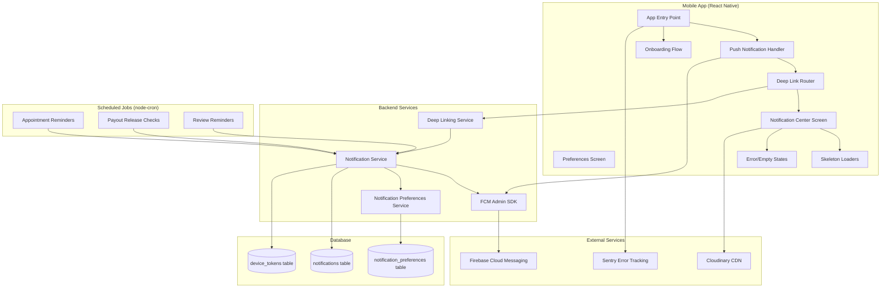
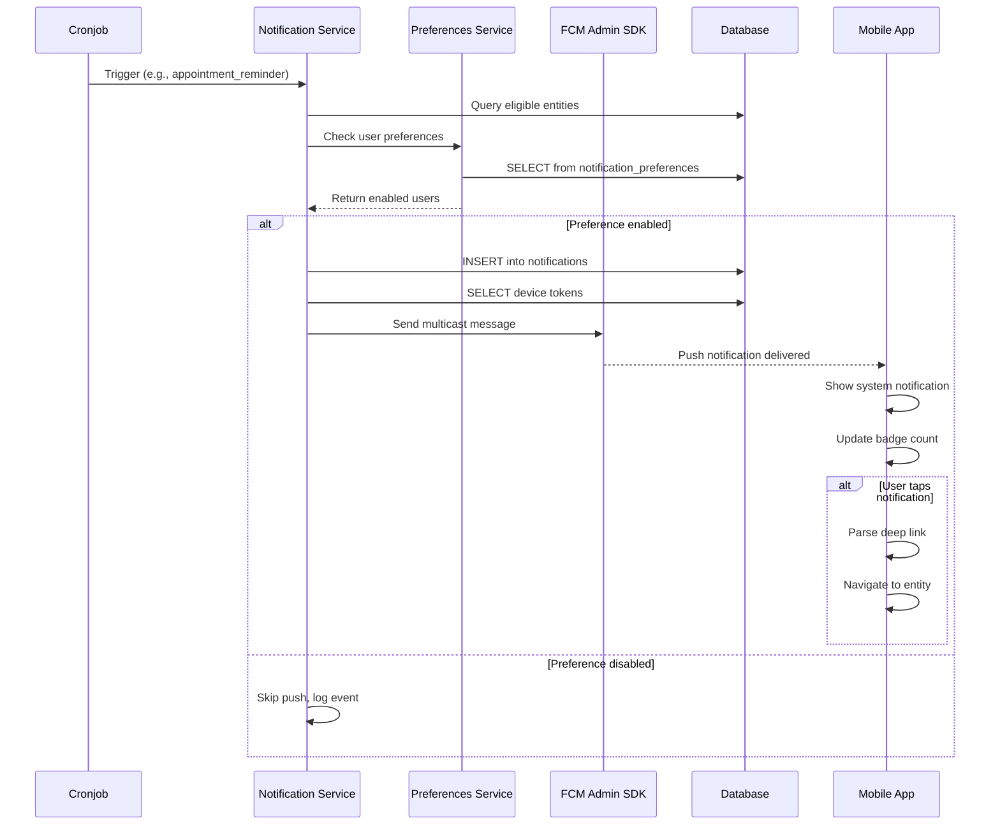
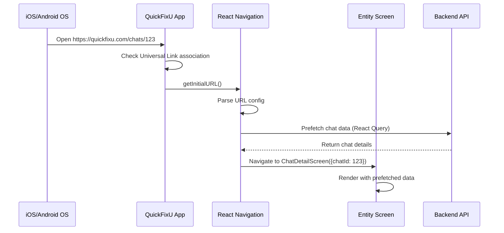

# Design: Fase 7 - Push Notifications & Polish

> **Historical artifact note (April 2026):** This design contains payment-related notification flows from the earlier V1 concept.
>
> Escrow, payout-release, and payment-confirmation notification assumptions here are **superseded for current V1** by:
> - `docs/PRD.md`
> - `docs/FunctionalFlow.md`
> - `docs/BusinessCase.md`
> - `docs/tickets/2026-04-v1-marketplace-pivot.md`
> - `docs/backend/V1NotificationEventBoundaries.md`
>
> Preserve this file for historical reference only.

## 1. Technical Approach

This design implements **Firebase Cloud Messaging (FCM) for push notifications**, **node-cron automated reminders**, **React Navigation deep linking**, and **comprehensive UX polish** for QuickFixU's final MVP phase.

**Architecture strategy:**
- **Notification-first:** Complete backend notification infrastructure with granular user preferences before frontend implementation
- **Cron-based automation:** Separate scheduled jobs for appointment reminders (24h), payout release checks (hourly), and review reminders (daily)
- **Deep linking native:** iOS Universal Links + Android App Links (no custom scheme fallback in production)
- **Performance-aware polish:** Skeleton loaders on ALL lists, React.memo selective memoization, optimistic UI for non-critical actions
- **Accessibility WCAG AA:** Screen reader support, 4.5:1 contrast ratio, dynamic font scaling up to 150%

**Alignment with exploration:**
- Implements ALL 9 new notification types (certification approved/rejected, appointment reminders, payout released, dispute resolved, new professional in area)
- Polling 30s for in-app notifications (Socket.io deferred to Phase 8)
- 15 notification preference types with intelligent defaults (critical ON, marketing OFF)
- Deep linking for 8 entity types (chats, appointments, reviews, posts, professionals, payouts, disputes, notifications)

---

## 2. Architecture Overview

### 2.1 High-Level System Diagram



### 2.2 Notification Flow Architecture



### 2.3 Deep Linking Flow



---

## 3. Architecture Decisions

### Decision 1: FCM vs OneSignal vs Expo Notifications

| Option | Pros | Cons |
|--------|------|------|
| **Firebase Cloud Messaging (FCM)** ✅ | Free unlimited, official Google/Apple integration, reliable delivery (~95%), granular control (data-only messages, priorities), rich analytics | Requires native modules (ejected Expo), setup complexity (APNs certificates, service account JSON) |
| OneSignal | Easy setup, unified API iOS/Android, free tier 10K MAU, web push support | Vendor lock-in, rate limits, less control over delivery, potential privacy concerns (third-party handles device tokens) |
| Expo Notifications | Zero config, works with Expo Go, push token management built-in | Not production-grade (unreliable delivery, no guaranteed SLA), limited to Expo ecosystem, can't customize notification channels |

**Choice**: FCM  
**Rationale**: Production-grade reliability required for critical notifications (payment released, certification approved). Free unlimited notifications removes cost concerns at scale. Native control enables advanced features (notification channels, custom sounds, badge management). Setup complexity is one-time cost acceptable for MVP.

### Decision 2: In-App Notifications Polling vs WebSocket

| Option | Pros | Cons |
|--------|------|------|
| **Polling 30s with React Query** ✅ | Simple implementation, leverages existing HTTP infra, automatic retry/exponential backoff, works with app backgrounding | 30s delay for in-app badge updates, higher battery usage than WebSocket, 2x more server requests than necessary (poll even if no new notifications) |
| Socket.io realtime | Instant updates (0s latency), single persistent connection, efficient for high-frequency updates | Adds infrastructure complexity (Socket.io server, connection management), harder to debug, requires reconnection logic on app resume, battery drain if not optimized |

**Choice**: Polling 30s for MVP, migrate to Socket.io in Phase 8 if UX demands it  
**Rationale**: 30s delay acceptable for in-app notification center (users don't live on that screen). Push notifications handle urgent use case (instant). React Query handles retry/cache/invalidation automatically. Socket.io deferred until user feedback proves latency is UX blocker.

### Decision 3: Notification Preferences Granularity

| Option | Pros | Cons |
|--------|------|------|
| **15 individual type toggles** ✅ | Maximum user control, industry standard (Gmail, Slack), enables A/B testing per type, legal compliance (marketing opt-out) | More UI space (Settings screen longer), DB writes on every toggle, harder to set intelligent defaults |
| 3 categories (transactional/engagement/marketing) | Simpler UI, fewer DB writes, easier mental model | Users can't disable "review_reminder" without disabling all engagement, all-or-nothing too coarse-grained |
| Global on/off only | Simplest implementation | Users silence ALL notifications when frustrated with one type, 100% opt-out risk |

**Choice**: 15 individual type toggles  
**Rationale**: Users tolerate useful notifications but rage-quit on spam. Granularity prevents nuclear option (disable all). Marketing notifications (new_professional_nearby) need separate opt-out for legal compliance (Argentina consumer protection law). Defaults mitigate UI complexity (critical ON, marketing OFF).

### Decision 4: Deep Linking Implementation

| Option | Pros | Cons |
|--------|------|------|
| **Universal Links (iOS) + App Links (Android)** ✅ | Standard behavior (no "Open with" dialog), SEO-friendly URLs, works from any app (email, browser, SMS), web fallback automatic | Requires backend serve `.well-known/` files, DNS HTTPS required, harder to test (can't use localhost), association file validation opaque (iOS fails silently) |
| Custom scheme only (`quickfixu://`) | Simple setup, works localhost, easy testing, no backend changes | Shows "Open with" dialog (poor UX), blocked by some apps (Gmail, Outlook), no web fallback, looks unprofessional |
| Branch.io deep linking SaaS | Handles all platform quirks, analytics built-in, deferred deep linking (install attribution), A/B testing links | $$$$ ($200/mo after 10K MAU), vendor lock-in, adds 15KB SDK, privacy concerns (third-party tracks all navigation) |

**Choice**: Universal Links + App Links (custom scheme only for development)  
**Rationale**: Professional UX requires standard deep linking. Web fallback essential for desktop users clicking notification emails. `.well-known/` backend cost is trivial (2 static JSON files). Branch.io overkill for MVP (no install attribution campaign yet). Custom scheme fallback for local testing only.

### Decision 5: Skeleton Loading Library

| Option | Pros | Cons |
|--------|------|------|
| **react-native-skeleton-placeholder** ✅ | Only viable RN library with 4K+ stars, shimmer animation built-in, customizable shapes (circle, rect), TypeScript support | Deprecated maintainer (last update 2023), uses deprecated Animated API, no Reanimated 2 version, 12KB bundle size |
| Custom implementation (Animated API) | Full control, zero dependencies, optimized bundle size | Time-consuming (2-3 days per skeleton variant), harder to maintain, no shimmer animation out-of-box |
| Lottie skeleton animations | Designer-friendly, smooth 60fps animations, infinitely customizable | Requires designer time, large file sizes (20-50KB per animation), overkill for simple loading states |

**Choice**: react-native-skeleton-placeholder  
**Rationale**: Despite deprecation, library is stable and functional (used in production by major apps). Custom implementation not worth 3-day time investment for MVP. Animated API deprecation not blocking (React Native team committed to 5-year support). 12KB acceptable for UX improvement. Revisit custom implementation Phase 8 if library breaks.

### Decision 6: Animation Library Strategy

| Use Case | Library | Rationale |
|----------|---------|-----------|
| **Critical transitions** (swipe gestures, shared element transitions) | Reanimated 2 | 60fps guaranteed (runs on UI thread), gesture-driven animations smooth, shared element native driver |
| **Simple animations** (fade, scale, rotate) | Animated API | Zero dependencies, smaller bundle, sufficient for non-gesture animations, familiar API |
| **Micro-interactions** (haptic feedback) | react-native-haptic-feedback | Standard library (8K stars), iOS/Android parity, minimal overhead |

**Rationale**: Avoid Reanimated 2 for everything (adds 200KB + learning curve). Use native Animated API for 80% of animations (fade in/out, scale buttons). Reserve Reanimated 2 for gestures (swipe to delete, pull-to-refresh customization) and shared element transitions (chat list → chat detail). Haptic feedback library for tactile feedback on critical actions (payment confirmed, appointment accepted).

### Decision 7: Onboarding Library

| Option | Pros | Cons |
|--------|------|------|
| **react-native-onboarding-swiper** ✅ | Swipeable pages built-in, pagination dots, skip button, 2.5K stars, TypeScript support | Basic styling (requires custom component override), 15KB bundle, last update 2022 |
| react-native-app-intro-slider | More customization options, parallax effects, video support | 45KB bundle (3x larger), overkill for simple onboarding, video not needed |
| Custom implementation (FlatList + Animated) | Full control, minimal bundle size | 2-day implementation time, harder pagination logic, accessibility edge cases |

**Choice**: react-native-onboarding-swiper  
**Rationale**: 3-page onboarding doesn't need parallax/video. 15KB acceptable for one-time screen. Library handles pagination, skip, done button out-of-box. Custom styling sufficient (override title/subtitle components with brand colors). 2-day time savings worth 15KB tradeoff.

### Decision 8: Image Caching Strategy

| Option | Pros | Cons |
|--------|------|------|
| **react-native-fast-image** ✅ | Native cache (iOS SDWebImage, Android Glide), priority levels, preload API, 8K stars | Deprecated (last update 2022), requires native linking, 50KB increase, maintainer inactive |
| expo-image | Modern replacement, active maintenance, built-in placeholder/blurhash, smaller bundle | Requires Expo SDK 47+ (breaking changes), less mature (1 year old), fewer features (no priority levels) |
| React Native Image default | Zero dependencies, native iOS/Android caching | No manual cache control, slower loading, no preload API, no progress indicator |

**Choice**: react-native-fast-image for MVP (migrate to expo-image Phase 8)  
**Rationale**: Despite deprecation, library is battle-tested and functional. Native SDWebImage/Glide cache proven at scale. Priority levels critical (profile photos HIGH, feed images LOW). expo-image migration planned Phase 8 when Expo SDK updated. 50KB acceptable for perceived performance boost (instant image loads).

### Decision 9: Error Tracking

| Option | Pros | Cons |
|--------|------|------|
| **Sentry** ✅ | Free tier 5K events/month, source maps support, release tracking, breadcrumbs, user context, performance monitoring | Expensive beyond free tier ($26/mo for 50K events), privacy concerns (sends stack traces), 90KB SDK |
| Bugsnag | Better free tier (7.5K events), simpler UI, lighter SDK (40KB) | Less mature React Native support, no performance monitoring free tier, fewer integrations |
| Custom logging (Cloudwatch/Logtail) | Full control, cheaper at scale, no privacy concerns | No crash grouping, no source maps, manual breadcrumb logging, harder debugging |

**Choice**: Sentry free tier  
**Rationale**: 5K events sufficient for MVP (<500 MAU). Source maps essential (minified production errors useless). Performance monitoring included (detect slow API calls). Breadcrumbs (user actions before crash) critical for debugging. Privacy acceptable (only send crashes, exclude PII). 90KB large but justified by debugging time savings.

---

## 4. Data Model Changes

### 4.1 New Tables

#### `notification_preferences`
```prisma
model NotificationPreference {
  id        Int      @id @default(autoincrement())
  userId    Int      @map("user_id")
  type      String   @db.VarChar(50) // Enum of 15 types
  enabled   Boolean  @default(true)
  createdAt DateTime @default(now()) @map("created_at")
  updatedAt DateTime @updatedAt @map("updated_at")
  
  user      User     @relation(fields: [userId], references: [id], onDelete: Cascade)
  
  @@unique([userId, type])
  @@index([userId])
  @@map("notification_preferences")
}
```

**15 notification types:**
- `new_quote` (default: ON)
- `quote_accepted` (default: ON)
- `message_received` (default: ON)
- `appointment_confirmed` (default: ON)
- `appointment_reminder` (default: ON)
- `payment_escrow_held` (default: ON)
- `payment_released` (default: ON)
- `work_confirmed` (default: ON)
- `review_received` (default: ON)
- `review_reminder` (default: OFF)
- `certification_approved` (default: ON)
- `certification_rejected` (default: ON)
- `dispute_resolved` (default: ON)
- `payout_released` (default: ON)
- `new_professional_nearby` (default: OFF)

**Migration strategy:**
1. Create table with defaults
2. Backfill existing users with all 15 types (enabled: intelligent defaults)
3. Add FK constraint to users table

#### Modifications to `notifications` table
```prisma
model Notification {
  // ... existing fields ...
  deepLink  String?  @map("deep_link") @db.VarChar(255) // New field
  read      Boolean  @default(false)                     // New field
  readAt    DateTime? @map("read_at")                    // New field
  
  @@index([userId, read])  // New composite index for unread queries
}
```

### 4.2 Database Indexes

```sql
-- Notification preferences fast lookup
CREATE INDEX idx_notification_preferences_user_type 
ON notification_preferences(user_id, type);

-- Unread notifications query optimization
CREATE INDEX idx_notifications_user_unread 
ON notifications(user_id, read) 
WHERE read = false;

-- Appointment reminders cronjob query
CREATE INDEX idx_appointments_reminder_pending 
ON appointments(scheduled_date, status) 
WHERE status IN ('confirmed', 'in_progress');

-- Payout release cronjob query
CREATE INDEX idx_escrows_release_pending 
ON escrow_transactions(release_date, status) 
WHERE status = 'held';
```

---

## 5. Backend Implementation

### 5.1 File Structure

```
backend/src/
├── controllers/
│   ├── notificationPreferences.controller.ts    [NEW]
│   └── notifications.controller.ts               [MODIFY - add mark as read]
├── services/
│   ├── notification.service.ts                   [MODIFY - add 9 new types]
│   ├── notificationPreferences.service.ts        [NEW]
│   ├── deepLinking.service.ts                    [NEW]
│   └── fcm.service.ts                            [MODIFY - add preference check]
├── cron/
│   ├── appointmentReminders.cron.ts              [NEW]
│   ├── payoutReleaseNotifications.cron.ts        [NEW]
│   ├── reviewReminders.cron.ts                   [NEW]
│   └── index.ts                                  [MODIFY - register new jobs]
├── middleware/
│   └── validation.middleware.ts                  [MODIFY - add preference schemas]
├── routes/
│   ├── notificationPreferences.routes.ts         [NEW]
│   └── notifications.routes.ts                   [MODIFY - add mark as read]
├── types/
│   └── notifications.types.ts                    [MODIFY - add new types enum]
└── utils/
    └── deepLinkGenerator.ts                      [NEW]
```

### 5.2 Notification Service Enhancement

```typescript
// backend/src/services/notification.service.ts

enum NotificationType {
  // Existing types (Phases 1-6)
  NEW_QUOTE = 'new_quote',
  QUOTE_ACCEPTED = 'quote_accepted',
  MESSAGE_RECEIVED = 'message_received',
  APPOINTMENT_CONFIRMED = 'appointment_confirmed',
  PAYMENT_ESCROW_HELD = 'payment_escrow_held',
  WORK_CONFIRMED = 'work_confirmed',
  REVIEW_RECEIVED = 'review_received',
  
  // Phase 7 new types
  APPOINTMENT_REMINDER = 'appointment_reminder',
  PAYMENT_RELEASED = 'payment_released',
  REVIEW_REMINDER = 'review_reminder',
  CERTIFICATION_APPROVED = 'certification_approved',
  CERTIFICATION_REJECTED = 'certification_rejected',
  DISPUTE_RESOLVED = 'dispute_resolved',
  PAYOUT_RELEASED = 'payout_released',
  NEW_PROFESSIONAL_NEARBY = 'new_professional_nearby',
}

interface NotificationPayload {
  type: NotificationType;
  title: string;
  body: string;
  data: {
    entityType: 'chat' | 'appointment' | 'review' | 'post' | 'professional' | 'payout' | 'dispute';
    entityId: number;
    deepLink: string;
  };
  priority: 'high' | 'normal';
}

class NotificationService {
  async sendNotification(userId: number, payload: NotificationPayload): Promise<void> {
    // 1. Check user preference
    const preference = await this.notificationPreferencesService.getPreference(
      userId,
      payload.type
    );
    
    if (!preference.enabled) {
      logger.info(`Notification skipped - user ${userId} disabled ${payload.type}`);
      return;
    }
    
    // 2. Save to database
    await prisma.notification.create({
      data: {
        userId,
        type: payload.type,
        title: payload.title,
        body: payload.body,
        deepLink: payload.data.deepLink,
        read: false,
      },
    });
    
    // 3. Send push notification via FCM
    const deviceTokens = await prisma.deviceToken.findMany({
      where: { userId, active: true },
      select: { token: true },
    });
    
    if (deviceTokens.length === 0) {
      logger.warn(`No device tokens for user ${userId}`);
      return;
    }
    
    await this.fcmService.sendMulticast({
      tokens: deviceTokens.map(d => d.token),
      notification: {
        title: payload.title,
        body: payload.body,
      },
      data: payload.data,
      apns: {
        payload: {
          aps: {
            badge: await this.getUnreadCount(userId),
            sound: 'default',
          },
        },
      },
      android: {
        priority: payload.priority === 'high' ? 'high' : 'normal',
        notification: {
          channelId: this.getChannelId(payload.type),
          sound: 'default',
        },
      },
    });
  }
  
  private getChannelId(type: NotificationType): string {
    // Map notification types to Android channels
    const criticalTypes = [
      NotificationType.PAYMENT_RELEASED,
      NotificationType.CERTIFICATION_APPROVED,
      NotificationType.CERTIFICATION_REJECTED,
      NotificationType.DISPUTE_RESOLVED,
    ];
    
    if (criticalTypes.includes(type)) return 'critical_updates';
    if (type === NotificationType.MESSAGE_RECEIVED) return 'messages';
    return 'general_updates';
  }
}
```

### 5.3 Cronjob Implementation

#### Appointment Reminders (Daily 9:00 AM)
```typescript
// backend/src/cron/appointmentReminders.cron.ts

import cron from 'node-cron';
import { NotificationService } from '../services/notification.service';
import { DeepLinkingService } from '../services/deepLinking.service';

// Run every day at 9:00 AM (0 9 * * *)
export const appointmentRemindersCron = cron.schedule('0 9 * * *', async () => {
  const tomorrow = new Date();
  tomorrow.setDate(tomorrow.getDate() + 1);
  tomorrow.setHours(0, 0, 0, 0);
  
  const tomorrowEnd = new Date(tomorrow);
  tomorrowEnd.setHours(23, 59, 59, 999);
  
  // Find appointments scheduled for tomorrow
  const appointments = await prisma.appointment.findMany({
    where: {
      scheduledDate: {
        gte: tomorrow,
        lte: tomorrowEnd,
      },
      status: { in: ['confirmed', 'in_progress'] },
    },
    include: {
      quote: {
        include: {
          post: { include: { user: true } },
          professional: { include: { user: true } },
        },
      },
    },
  });
  
  for (const appointment of appointments) {
    const client = appointment.quote.post.user;
    const professional = appointment.quote.professional.user;
    
    // Notify client
    await NotificationService.sendNotification(client.id, {
      type: NotificationType.APPOINTMENT_REMINDER,
      title: '📅 Recordatorio de turno',
      body: `Tu trabajo con ${professional.firstName} es mañana a las ${formatTime(appointment.scheduledDate)}`,
      data: {
        entityType: 'appointment',
        entityId: appointment.id,
        deepLink: DeepLinkingService.generate('appointment', appointment.id),
      },
      priority: 'high',
    });
    
    // Notify professional
    await NotificationService.sendNotification(professional.id, {
      type: NotificationType.APPOINTMENT_REMINDER,
      title: '📅 Recordatorio de trabajo',
      body: `Tienes trabajo con ${client.firstName} mañana a las ${formatTime(appointment.scheduledDate)}`,
      data: {
        entityType: 'appointment',
        entityId: appointment.id,
        deepLink: DeepLinkingService.generate('appointment', appointment.id),
      },
      priority: 'high',
    });
  }
  
  logger.info(`Sent ${appointments.length * 2} appointment reminders`);
});
```

#### Payout Release Notifications (Hourly)
```typescript
// backend/src/cron/payoutReleaseNotifications.cron.ts

// Run every hour at minute 0 (0 * * * *)
export const payoutReleaseNotificationsCron = cron.schedule('0 * * * *', async () => {
  const now = new Date();
  
  // Find escrows released in the last hour
  const releasedEscrows = await prisma.escrowTransaction.findMany({
    where: {
      status: 'released',
      releasedAt: {
        gte: new Date(now.getTime() - 60 * 60 * 1000), // Last hour
      },
      notificationSent: false,
    },
    include: {
      appointment: {
        include: {
          quote: {
            include: { professional: { include: { user: true } } },
          },
        },
      },
    },
  });
  
  for (const escrow of releasedEscrows) {
    const professional = escrow.appointment.quote.professional.user;
    
    await NotificationService.sendNotification(professional.id, {
      type: NotificationType.PAYOUT_RELEASED,
      title: '💰 Pago liberado',
      body: `$${escrow.amount.toFixed(2)} fue liberado y estará en tu cuenta en 24-48hs`,
      data: {
        entityType: 'payout',
        entityId: escrow.id,
        deepLink: DeepLinkingService.generate('payout', escrow.id),
      },
      priority: 'high',
    });
    
    // Mark as notified
    await prisma.escrowTransaction.update({
      where: { id: escrow.id },
      data: { notificationSent: true },
    });
  }
  
  logger.info(`Sent ${releasedEscrows.length} payout release notifications`);
});
```

#### Review Reminders (Daily 6:00 PM)
```typescript
// backend/src/cron/reviewReminders.cron.ts

// Run every day at 6:00 PM (0 18 * * *)
export const reviewRemindersCron = cron.schedule('0 18 * * *', async () => {
  const threeDaysAgo = new Date();
  threeDaysAgo.setDate(threeDaysAgo.getDate() - 3);
  
  // Find completed appointments with no reviews (after 3 days)
  const appointmentsNeedingReviews = await prisma.appointment.findMany({
    where: {
      status: 'completed',
      completedAt: {
        lte: threeDaysAgo,
      },
      review: null, // No review yet
    },
    include: {
      quote: {
        include: {
          post: { include: { user: true } },
          professional: { include: { user: true } },
        },
      },
    },
  });
  
  for (const appointment of appointmentsNeedingReviews) {
    const client = appointment.quote.post.user;
    const professional = appointment.quote.professional.user;
    
    // Remind client to review professional
    await NotificationService.sendNotification(client.id, {
      type: NotificationType.REVIEW_REMINDER,
      title: '⭐ ¿Cómo te fue con el trabajo?',
      body: `Ayuda a otros usuarios evaluando a ${professional.firstName}`,
      data: {
        entityType: 'review',
        entityId: appointment.id,
        deepLink: DeepLinkingService.generate('review', appointment.id),
      },
      priority: 'normal',
    });
    
    // Remind professional to review client
    await NotificationService.sendNotification(professional.id, {
      type: NotificationType.REVIEW_REMINDER,
      title: '⭐ Evalúa tu experiencia',
      body: `¿Cómo fue trabajar con ${client.firstName}?`,
      data: {
        entityType: 'review',
        entityId: appointment.id,
        deepLink: DeepLinkingService.generate('review', appointment.id),
      },
      priority: 'normal',
    });
  }
  
  logger.info(`Sent ${appointmentsNeedingReviews.length * 2} review reminders`);
});
```

### 5.4 Deep Linking Service

```typescript
// backend/src/services/deepLinking.service.ts

type EntityType = 'chat' | 'appointment' | 'review' | 'post' | 'professional' | 'payout' | 'dispute' | 'notification';

export class DeepLinkingService {
  private static readonly BASE_URL = process.env.DEEP_LINK_BASE_URL || 'https://quickfixu.com';
  
  static generate(entityType: EntityType, entityId: number): string {
    const pathMap: Record<EntityType, string> = {
      chat: `/chats/${entityId}`,
      appointment: `/appointments/${entityId}`,
      review: `/reviews/create/${entityId}`,
      post: `/posts/${entityId}`,
      professional: `/professionals/${entityId}`,
      payout: `/payouts/${entityId}`,
      dispute: `/disputes/${entityId}`,
      notification: `/notifications`,
    };
    
    return `${this.BASE_URL}${pathMap[entityType]}`;
  }
  
  static async serveAppleAppSiteAssociation(req, res) {
    // Serve .well-known/apple-app-site-association
    res.setHeader('Content-Type', 'application/json');
    res.json({
      applinks: {
        apps: [],
        details: [
          {
            appID: `${process.env.APPLE_TEAM_ID}.com.quickfixu.app`,
            paths: [
              '/chats/*',
              '/appointments/*',
              '/reviews/*',
              '/posts/*',
              '/professionals/*',
              '/payouts/*',
              '/disputes/*',
              '/notifications',
            ],
          },
        ],
      },
    });
  }
  
  static async serveAssetLinks(req, res) {
    // Serve .well-known/assetlinks.json (Android App Links)
    res.setHeader('Content-Type', 'application/json');
    res.json([
      {
        relation: ['delegate_permission/common.handle_all_urls'],
        target: {
          namespace: 'android_app',
          package_name: 'com.quickfixu.app',
          sha256_cert_fingerprints: [
            process.env.ANDROID_SHA256_FINGERPRINT,
          ],
        },
      },
    ]);
  }
}
```

### 5.5 New API Endpoints

```typescript
// GET /api/notification-preferences
// Response: Array of NotificationPreference
{
  preferences: [
    { type: 'new_quote', enabled: true },
    { type: 'review_reminder', enabled: false },
    // ... 15 types
  ]
}

// PUT /api/notification-preferences/:type
// Request: { enabled: boolean }
// Response: { success: true }

// GET /api/notifications?limit=20&offset=0
// Response: Paginated notifications with unread count
{
  notifications: [...],
  unreadCount: 5,
  hasMore: true
}

// PUT /api/notifications/:id/read
// Response: { success: true }

// PUT /api/notifications/read-all
// Response: { success: true, count: 12 }

// GET /.well-known/apple-app-site-association
// Response: JSON (iOS Universal Links association)

// GET /.well-known/assetlinks.json
// Response: JSON (Android App Links association)
```

---

## 6. Mobile App Implementation

### 6.1 File Structure

```
mobile/src/
├── screens/
│   ├── NotificationsScreen.tsx                   [NEW]
│   ├── NotificationPreferencesScreen.tsx         [NEW]
│   ├── OnboardingScreen.tsx                      [NEW]
│   ├── HomeScreen.tsx                            [MODIFY - add skeleton]
│   ├── ChatsScreen.tsx                           [MODIFY - add skeleton]
│   └── ProfileScreen.tsx                         [MODIFY - add pull-to-refresh]
├── components/
│   ├── notifications/
│   │   ├── NotificationCard.tsx                  [NEW]
│   │   └── NotificationBadge.tsx                 [NEW]
│   ├── skeletons/
│   │   ├── SkeletonPostCard.tsx                  [NEW]
│   │   ├── SkeletonChatList.tsx                  [NEW]
│   │   ├── SkeletonProfessionalCard.tsx          [NEW]
│   │   └── SkeletonProfileHeader.tsx             [NEW]
│   ├── states/
│   │   ├── EmptyState.tsx                        [NEW]
│   │   ├── ErrorState.tsx                        [NEW]
│   │   └── OfflineBanner.tsx                     [NEW]
│   └── onboarding/
│       ├── ClientOnboarding.tsx                  [NEW]
│       └── ProfessionalOnboarding.tsx            [NEW]
├── navigation/
│   ├── linking.ts                                [NEW]
│   └── RootNavigator.tsx                         [MODIFY - add deep linking]
├── hooks/
│   ├── useNotifications.ts                       [NEW]
│   ├── useNotificationPreferences.ts             [NEW]
│   ├── usePushNotifications.ts                   [NEW]
│   └── useOnboarding.ts                          [NEW]
├── utils/
│   ├── deepLinking.ts                            [NEW]
│   ├── haptics.ts                                [NEW]
│   └── accessibility.ts                          [NEW]
├── services/
│   └── notificationPolling.service.ts            [NEW]
└── App.tsx                                       [MODIFY - init Sentry, deep linking]
```

### 6.2 Deep Linking Configuration

```typescript
// mobile/src/navigation/linking.ts

import { LinkingOptions } from '@react-navigation/native';
import * as Linking from 'expo-linking';

const prefix = Linking.createURL('/');

export const linking: LinkingOptions<ReactNavigation.RootParamList> = {
  prefixes: [
    prefix,
    'https://quickfixu.com',
    'https://www.quickfixu.com',
    'quickfixu://', // Fallback for development
  ],
  config: {
    screens: {
      Home: '',
      ChatDetail: {
        path: 'chats/:chatId',
        parse: {
          chatId: (chatId: string) => parseInt(chatId, 10),
        },
      },
      AppointmentDetail: {
        path: 'appointments/:appointmentId',
        parse: {
          appointmentId: (id: string) => parseInt(id, 10),
        },
      },
      ReviewCreate: {
        path: 'reviews/create/:appointmentId',
        parse: {
          appointmentId: (id: string) => parseInt(id, 10),
        },
      },
      PostDetail: {
        path: 'posts/:postId',
        parse: {
          postId: (id: string) => parseInt(id, 10),
        },
      },
      ProfessionalProfile: {
        path: 'professionals/:professionalId',
        parse: {
          professionalId: (id: string) => parseInt(id, 10),
        },
      },
      PayoutDetail: {
        path: 'payouts/:payoutId',
        parse: {
          payoutId: (id: string) => parseInt(id, 10),
        },
      },
      DisputeDetail: {
        path: 'disputes/:disputeId',
        parse: {
          disputeId: (id: string) => parseInt(id, 10),
        },
      },
      Notifications: 'notifications',
      NotFound: '*',
    },
  },
  async getInitialURL() {
    // Check for deep link URL (app opened from notification or link)
    const url = await Linking.getInitialURL();
    if (url != null) {
      return url;
    }
    
    // Check for notification that opened the app
    const notification = await Notifications.getLastNotificationResponseAsync();
    return notification?.notification.request.content.data.deepLink as string | null;
  },
  subscribe(listener) {
    // Listen for deep link events (app already open)
    const onReceiveURL = ({ url }: { url: string }) => {
      listener(url);
    };
    
    const linkingSubscription = Linking.addEventListener('url', onReceiveURL);
    
    // Listen for notification events (app in foreground/background)
    const notificationSubscription = Notifications.addNotificationResponseReceivedListener(
      (response) => {
        const url = response.notification.request.content.data.deepLink as string;
        if (url) {
          listener(url);
        }
      }
    );
    
    return () => {
      linkingSubscription.remove();
      notificationSubscription.remove();
    };
  },
};
```

### 6.3 Push Notification Setup

```typescript
// mobile/src/hooks/usePushNotifications.ts

import * as Notifications from 'expo-notifications';
import * as Device from 'expo-device';
import { Platform } from 'react-native';
import { useEffect } from 'react';

// Configure notification behavior
Notifications.setNotificationHandler({
  handleNotification: async () => ({
    shouldShowAlert: true,
    shouldPlaySound: true,
    shouldSetBadge: true,
  }),
});

export function usePushNotifications() {
  useEffect(() => {
    registerForPushNotifications();
    
    // Handle notification received while app is in foreground
    const foregroundSubscription = Notifications.addNotificationReceivedListener(
      (notification) => {
        console.log('Notification received in foreground:', notification);
        // Show in-app banner or update badge count
      }
    );
    
    return () => {
      foregroundSubscription.remove();
    };
  }, []);
  
  async function registerForPushNotifications() {
    if (!Device.isDevice) {
      console.warn('Push notifications only work on physical devices');
      return;
    }
    
    // Request permissions
    const { status: existingStatus } = await Notifications.getPermissionsAsync();
    let finalStatus = existingStatus;
    
    if (existingStatus !== 'granted') {
      const { status } = await Notifications.requestPermissionsAsync();
      finalStatus = status;
    }
    
    if (finalStatus !== 'granted') {
      console.log('Push notification permission denied');
      return;
    }
    
    // Get FCM token
    const token = (await Notifications.getExpoPushTokenAsync()).data;
    
    // Send token to backend
    await api.post('/device-tokens', { token, platform: Platform.OS });
    
    // Configure Android notification channels
    if (Platform.OS === 'android') {
      await Notifications.setNotificationChannelAsync('critical_updates', {
        name: 'Actualizaciones Críticas',
        importance: Notifications.AndroidImportance.HIGH,
        vibrationPattern: [0, 250, 250, 250],
        lightColor: '#FF231F7C',
      });
      
      await Notifications.setNotificationChannelAsync('messages', {
        name: 'Mensajes',
        importance: Notifications.AndroidImportance.HIGH,
        vibrationPattern: [0, 250],
        lightColor: '#0000FF',
      });
      
      await Notifications.setNotificationChannelAsync('general_updates', {
        name: 'Actualizaciones Generales',
        importance: Notifications.AndroidImportance.DEFAULT,
      });
    }
  }
}
```

### 6.4 In-App Notification Center

```typescript
// mobile/src/screens/NotificationsScreen.tsx

import React from 'react';
import { FlatList, RefreshControl } from 'react-native';
import { useQuery, useMutation, useQueryClient } from '@tanstack/react-query';
import NotificationCard from '../components/notifications/NotificationCard';
import EmptyState from '../components/states/EmptyState';

export default function NotificationsScreen() {
  const queryClient = useQueryClient();
  
  const { data, isLoading, refetch, isRefetching } = useQuery({
    queryKey: ['notifications'],
    queryFn: () => api.get('/notifications?limit=50'),
    refetchInterval: 30000, // Poll every 30 seconds
  });
  
  const markAsReadMutation = useMutation({
    mutationFn: (notificationId: number) => 
      api.put(`/notifications/${notificationId}/read`),
    onSuccess: () => {
      queryClient.invalidateQueries(['notifications']);
    },
  });
  
  const markAllAsReadMutation = useMutation({
    mutationFn: () => api.put('/notifications/read-all'),
    onSuccess: () => {
      queryClient.invalidateQueries(['notifications']);
    },
  });
  
  if (isLoading) {
    return <SkeletonNotificationList />;
  }
  
  if (!data?.notifications.length) {
    return (
      <EmptyState
        icon="bell-outline"
        title="Sin notificaciones"
        description="Te avisaremos cuando tengas algo nuevo"
      />
    );
  }
  
  return (
    <FlatList
      data={data.notifications}
      keyExtractor={(item) => item.id.toString()}
      renderItem={({ item }) => (
        <NotificationCard
          notification={item}
          onPress={() => markAsReadMutation.mutate(item.id)}
        />
      )}
      refreshControl={
        <RefreshControl refreshing={isRefetching} onRefresh={refetch} />
      }
      ListHeaderComponent={
        data.unreadCount > 0 && (
          <Button
            title={`Marcar todas como leídas (${data.unreadCount})`}
            onPress={() => markAllAsReadMutation.mutate()}
          />
        )
      }
    />
  );
}
```

### 6.5 Skeleton Loaders

```typescript
// mobile/src/components/skeletons/SkeletonPostCard.tsx

import React from 'react';
import { View, StyleSheet } from 'react-native';
import SkeletonPlaceholder from 'react-native-skeleton-placeholder';

export default function SkeletonPostCard() {
  return (
    <SkeletonPlaceholder>
      <View style={styles.card}>
        <View style={styles.header}>
          <View style={styles.avatar} />
          <View style={styles.userInfo}>
            <View style={styles.name} />
            <View style={styles.location} />
          </View>
        </View>
        <View style={styles.title} />
        <View style={styles.description} />
        <View style={styles.footer}>
          <View style={styles.category} />
          <View style={styles.time} />
        </View>
      </View>
    </SkeletonPlaceholder>
  );
}

const styles = StyleSheet.create({
  card: { padding: 16, marginBottom: 8, backgroundColor: '#fff' },
  header: { flexDirection: 'row', marginBottom: 12 },
  avatar: { width: 40, height: 40, borderRadius: 20 },
  userInfo: { marginLeft: 12, justifyContent: 'center' },
  name: { width: 120, height: 14, borderRadius: 4, marginBottom: 6 },
  location: { width: 80, height: 12, borderRadius: 4 },
  title: { width: '100%', height: 18, borderRadius: 4, marginBottom: 8 },
  description: { width: '100%', height: 14, borderRadius: 4, marginBottom: 4 },
  footer: { flexDirection: 'row', marginTop: 12 },
  category: { width: 60, height: 20, borderRadius: 10, marginRight: 12 },
  time: { width: 40, height: 14, borderRadius: 4 },
});
```

### 6.6 Onboarding Flow

```typescript
// mobile/src/screens/OnboardingScreen.tsx

import React from 'react';
import Onboarding from 'react-native-onboarding-swiper';
import { useNavigation } from '@react-navigation/native';
import AsyncStorage from '@react-native-async-storage/async-storage';
import { useAuth } from '../hooks/useAuth';

const CLIENT_PAGES = [
  {
    backgroundColor: '#fff',
    image: <Image source={require('../assets/onboarding-1.png')} />,
    title: 'Encuentra profesionales verificados',
    subtitle: 'Electricistas, plomeros y gasistas certificados cerca tuyo',
  },
  {
    backgroundColor: '#fff',
    image: <Image source={require('../assets/onboarding-2.png')} />,
    title: 'Recibe presupuestos al instante',
    subtitle: 'Publica tu problema y compara múltiples ofertas',
  },
  {
    backgroundColor: '#fff',
    image: <Image source={require('../assets/onboarding-3.png')} />,
    title: 'Pago seguro con garantía',
    subtitle: 'Tu dinero queda retenido hasta confirmar el trabajo',
  },
];

const PROFESSIONAL_PAGES = [
  {
    backgroundColor: '#fff',
    image: <Image source={require('../assets/onboarding-pro-1.png')} />,
    title: 'Recibe trabajos constantes',
    subtitle: 'Aparece en el feed de clientes cerca tuyo (30km)',
  },
  {
    backgroundColor: '#fff',
    image: <Image source={require('../assets/onboarding-pro-2.png')} />,
    title: '0% comisión el primer año',
    subtitle: 'Registra tu tarjeta y trabaja sin comisiones por 12 meses',
  },
  {
    backgroundColor: '#fff',
    image: <Image source={require('../assets/onboarding-pro-3.png')} />,
    title: 'Cobra seguro y rápido',
    subtitle: 'Pagos garantizados, sin clientes morosos',
  },
  {
    backgroundColor: '#fff',
    image: <Image source={require('../assets/onboarding-pro-4.png')} />,
    title: 'Construye tu reputación',
    subtitle: 'Ratings y reseñas te ayudan a conseguir más trabajos',
  },
];

export default function OnboardingScreen() {
  const navigation = useNavigation();
  const { user } = useAuth();
  
  const isProfessional = user?.isProfessional; // Derived from professionals table
  const pages = isProfessional ? PROFESSIONAL_PAGES : CLIENT_PAGES;
  
  async function handleDone() {
    await AsyncStorage.setItem('onboarding_completed', 'true');
    navigation.replace('Home');
  }
  
  return (
    <Onboarding
      pages={pages}
      onDone={handleDone}
      onSkip={handleDone}
      showSkip
      skipLabel="Saltar"
      nextLabel="Siguiente"
      doneLabel="Comenzar"
    />
  );
}
```

### 6.7 Error & Empty States

```typescript
// mobile/src/components/states/ErrorState.tsx

import React from 'react';
import { View, Text, Button } from 'react-native';
import { useQueryClient } from '@tanstack/react-query';

interface ErrorStateProps {
  title?: string;
  description?: string;
  queryKey?: string[];
  onRetry?: () => void;
}

export default function ErrorState({
  title = 'Algo salió mal',
  description = 'No pudimos cargar esta información',
  queryKey,
  onRetry,
}: ErrorStateProps) {
  const queryClient = useQueryClient();
  
  const handleRetry = () => {
    if (onRetry) {
      onRetry();
    } else if (queryKey) {
      queryClient.invalidateQueries(queryKey);
    }
  };
  
  return (
    <View style={{ flex: 1, justifyContent: 'center', alignItems: 'center', padding: 24 }}>
      <Text style={{ fontSize: 48, marginBottom: 16 }}>⚠️</Text>
      <Text style={{ fontSize: 18, fontWeight: '600', marginBottom: 8 }}>{title}</Text>
      <Text style={{ fontSize: 14, color: '#666', marginBottom: 24, textAlign: 'center' }}>
        {description}
      </Text>
      <Button title="Reintentar" onPress={handleRetry} />
    </View>
  );
}
```

### 6.8 Accessibility Implementation

```typescript
// mobile/src/utils/accessibility.ts

import { AccessibilityInfo } from 'react-native';

export function getAccessibilityLabel(
  label: string,
  hint?: string
): { accessibilityLabel: string; accessibilityHint?: string } {
  return {
    accessibilityLabel: label,
    accessibilityHint: hint,
  };
}

// Example usage in NotificationCard
<TouchableOpacity
  {...getAccessibilityLabel(
    `Notificación de ${notification.title}`,
    'Toca para ver detalles y marcar como leída'
  )}
  accessibilityRole="button"
  accessibilityState={{ selected: !notification.read }}
  onPress={handlePress}
>
  <Text maxFontSizeMultiplier={1.5}>{notification.title}</Text>
</TouchableOpacity>
```

---

## 7. Testing Strategy

### 7.1 Backend Tests

| Layer | What to Test | Approach | Tools |
|-------|-------------|----------|-------|
| **Unit** | Notification service preference filtering | Mock Prisma, assert `sendNotification` skips disabled types | Jest + Prisma mock |
| **Unit** | Deep link generator URL format | Test all 8 entity types return correct paths | Jest |
| **Integration** | Notification preferences API CRUD | Supertest `/notification-preferences` endpoints | Jest + Supertest |
| **Integration** | FCM token validation | Test duplicate tokens, expired tokens, token refresh | Jest + FCM Admin SDK mock |
| **E2E** | Cronjob execution | Run cron manually in test env, assert notifications created | Jest + node-cron |

### 7.2 Mobile Tests

| Layer | What to Test | Approach | Tools |
|-------|-------------|----------|-------|
| **Component** | Skeleton loaders render | Snapshot test all skeleton variants | React Native Testing Library |
| **Component** | Empty/Error states render | Test EmptyState with different props | React Native Testing Library |
| **Integration** | Deep linking navigation | Simulate URL open, assert correct screen shown | React Navigation testing library |
| **Integration** | Notification preference toggles | Toggle setting, assert API called, optimistic update shown | React Query + MSW mock |
| **E2E** | Push notification tap | Send test notification, tap, assert deep link navigation | Detox (iOS/Android) |
| **E2E** | Onboarding flow | Complete flow, assert AsyncStorage flag set | Detox |

### 7.3 Manual Testing Checklist

**Deep Linking:**
- [ ] iOS Universal Links work (TestFlight build, tap link in Notes app)
- [ ] Android App Links work (APK, tap link in Gmail)
- [ ] Custom scheme fallback works (development build)
- [ ] All 8 entity types deep link correctly
- [ ] Deep link from killed app state (cold start)
- [ ] Deep link from background app state (warm start)

**Push Notifications:**
- [ ] Notification received when app in foreground (shows in-app banner)
- [ ] Notification received when app in background (shows system notification)
- [ ] Notification received when app killed (shows system notification, opens app on tap)
- [ ] Badge count updates correctly
- [ ] Android notification channels work (critical/messages/general)
- [ ] iOS notification sounds work
- [ ] Notification preferences respected (disabled types NOT sent)

**Accessibility:**
- [ ] VoiceOver (iOS) can navigate all screens
- [ ] TalkBack (Android) can navigate all screens
- [ ] Contrast ratio WCAG AA compliant (test with Colour Contrast Analyser)
- [ ] Font scaling 150% doesn't break UI (Settings > Display > Font Size)
- [ ] All interactive elements have accessibility labels

**Performance:**
- [ ] Skeleton loaders show instantly (<100ms)
- [ ] Images load fast (fast-image cache working)
- [ ] No jank on scroll (60fps maintained)
- [ ] App size <50MB (check in App Store Connect / Play Console)

---

## 8. Performance Optimizations

### 8.1 React Query Configuration

```typescript
// mobile/src/config/reactQuery.ts

export const queryClient = new QueryClient({
  defaultOptions: {
    queries: {
      staleTime: 5 * 60 * 1000, // 5 minutes (default)
      cacheTime: 10 * 60 * 1000, // 10 minutes
      retry: 3,
      retryDelay: (attemptIndex) => Math.min(1000 * 2 ** attemptIndex, 30000), // Exponential backoff
      refetchOnWindowFocus: false, // Avoid refetch on app resume (mobile-specific)
    },
  },
});

// Custom stale times per query
export const queryConfig = {
  feed: { staleTime: 2 * 60 * 1000 }, // 2 min (frequent updates)
  profile: { staleTime: 30 * 60 * 1000 }, // 30 min (rarely changes)
  notifications: { staleTime: 30 * 1000 }, // 30s (polling interval)
  chats: { staleTime: 1 * 60 * 1000 }, // 1 min (real-time-ish)
};
```

### 8.2 Image Optimization

```typescript
// mobile/src/components/OptimizedImage.tsx

import FastImage from 'react-native-fast-image';

interface OptimizedImageProps {
  uri: string;
  priority?: 'low' | 'normal' | 'high';
  style?: any;
}

export default function OptimizedImage({ uri, priority = 'normal', style }: OptimizedImageProps) {
  return (
    <FastImage
      source={{
        uri,
        priority: FastImage.priority[priority],
        cache: FastImage.cacheControl.immutable,
      }}
      resizeMode={FastImage.resizeMode.cover}
      style={style}
    />
  );
}

// Preload critical images
FastImage.preload([
  { uri: 'https://cloudinary.com/.../avatar.jpg', priority: FastImage.priority.high },
  { uri: 'https://cloudinary.com/.../cover.jpg', priority: FastImage.priority.normal },
]);
```

### 8.3 List Performance (React.memo)

```typescript
// mobile/src/components/PostCard.tsx

import React from 'react';

interface PostCardProps {
  post: Post;
  onPress: (postId: number) => void;
}

const PostCard = React.memo(({ post, onPress }: PostCardProps) => {
  return (
    <TouchableOpacity onPress={() => onPress(post.id)}>
      {/* Card content */}
    </TouchableOpacity>
  );
}, (prevProps, nextProps) => {
  // Custom comparison (only re-render if post ID changed)
  return prevProps.post.id === nextProps.post.id;
});

export default PostCard;
```

### 8.4 Optimistic UI

```typescript
// mobile/src/hooks/useMarkAsRead.ts

import { useMutation, useQueryClient } from '@tanstack/react-query';

export function useMarkAsRead() {
  const queryClient = useQueryClient();
  
  return useMutation({
    mutationFn: (notificationId: number) => 
      api.put(`/notifications/${notificationId}/read`),
    
    // Optimistic update (instant UI feedback)
    onMutate: async (notificationId) => {
      await queryClient.cancelQueries(['notifications']);
      
      const previousNotifications = queryClient.getQueryData(['notifications']);
      
      queryClient.setQueryData(['notifications'], (old: any) => ({
        ...old,
        notifications: old.notifications.map((n: Notification) =>
          n.id === notificationId ? { ...n, read: true } : n
        ),
        unreadCount: Math.max(0, old.unreadCount - 1),
      }));
      
      return { previousNotifications };
    },
    
    // Rollback on error
    onError: (err, notificationId, context) => {
      queryClient.setQueryData(['notifications'], context?.previousNotifications);
    },
    
    // Refetch on success (ensure sync with backend)
    onSettled: () => {
      queryClient.invalidateQueries(['notifications']);
    },
  });
}
```

---

## 9. Migration & Rollout

### 9.1 Database Migration

```sql
-- Step 1: Create notification_preferences table
CREATE TABLE notification_preferences (
  id SERIAL PRIMARY KEY,
  user_id INTEGER NOT NULL REFERENCES users(id) ON DELETE CASCADE,
  type VARCHAR(50) NOT NULL,
  enabled BOOLEAN DEFAULT TRUE,
  created_at TIMESTAMP DEFAULT NOW(),
  updated_at TIMESTAMP DEFAULT NOW(),
  
  CONSTRAINT notification_preferences_user_type_unique UNIQUE (user_id, type)
);

CREATE INDEX idx_notification_preferences_user_type ON notification_preferences(user_id, type);

-- Step 2: Backfill existing users with default preferences
INSERT INTO notification_preferences (user_id, type, enabled)
SELECT 
  u.id,
  unnest(ARRAY[
    'new_quote', 'quote_accepted', 'message_received', 'appointment_confirmed',
    'appointment_reminder', 'payment_escrow_held', 'payment_released', 'work_confirmed',
    'review_received', 'review_reminder', 'certification_approved', 'certification_rejected',
    'dispute_resolved', 'payout_released', 'new_professional_nearby'
  ]),
  CASE unnest(ARRAY[
    'new_quote', 'quote_accepted', 'message_received', 'appointment_confirmed',
    'appointment_reminder', 'payment_escrow_held', 'payment_released', 'work_confirmed',
    'review_received', 'review_reminder', 'certification_approved', 'certification_rejected',
    'dispute_resolved', 'payout_released', 'new_professional_nearby'
  ])
    WHEN 'review_reminder' THEN FALSE
    WHEN 'new_professional_nearby' THEN FALSE
    ELSE TRUE
  END
FROM users u
ON CONFLICT (user_id, type) DO NOTHING;

-- Step 3: Add new columns to notifications table
ALTER TABLE notifications
ADD COLUMN deep_link VARCHAR(255),
ADD COLUMN read BOOLEAN DEFAULT FALSE,
ADD COLUMN read_at TIMESTAMP;

CREATE INDEX idx_notifications_user_unread ON notifications(user_id, read) WHERE read = FALSE;

-- Step 4: Add notification_sent flag to escrow_transactions
ALTER TABLE escrow_transactions
ADD COLUMN notification_sent BOOLEAN DEFAULT FALSE;
```

### 9.2 Rollout Plan

**Phase 1: Backend Infrastructure (Week 1)**
1. Deploy notification preferences table + API
2. Deploy new notification types (no cronjobs yet)
3. Deploy deep linking endpoints (`.well-known/` files)
4. Test manually with Postman

**Phase 2: Mobile App Update (Week 2)**
1. Submit iOS TestFlight build with Universal Links config
2. Test deep linking with TestFlight (invite 10 beta testers)
3. Fix iOS Universal Links issues (common: association file not served over HTTPS)
4. Submit Android APK with App Links config
5. Test deep linking with APK (install manually on 5 devices)

**Phase 3: Gradual Rollout (Week 3)**
1. Enable cronjobs (appointment reminders, review reminders, payout checks)
2. Monitor Sentry for errors (first 48 hours)
3. Monitor notification delivery rate (FCM console)
4. A/B test onboarding (50% see onboarding, 50% skip) → measure retention

**Phase 4: Full Rollout (Week 4)**
1. Submit production builds to App Store + Play Store
2. Release to 100% users
3. Monitor metrics (opt-out rate, deep link success rate, crash-free rate)

**Rollback triggers:**
- Notification delivery rate drops below 80%
- Crash-free rate drops below 99%
- Deep link success rate below 70%
- Opt-out rate exceeds 30%

---

## 10. Open Questions

**Resolved in spec:**
- [ ] ¿Fases 5-6 YA implementaron notificaciones certificación/review? → Verificar código fase 5/6
- [ ] ¿Frecuencia exacta cronjobs? → Appointment reminders 1x/día 9am, payout checks 1x/hora, review reminders 1x/día 6pm
- [ ] ¿Copy exacto notificaciones? → Definir 15 títulos + bodies en español rioplatense
- [ ] ¿Animaciones cuáles pantallas priorizar? → Chat list → chat detail (shared element), swipe to delete (reanimated)
- [ ] ¿Lottie animations diseño custom o LottieFiles community? → LottieFiles community (free, MIT license)

**Needs product decision:**
- [ ] ¿Notification sound personalizado o default sistema?
- [ ] ¿Badge count incluye mensajes sin leer + notificaciones? ¿O solo notificaciones?
- [ ] ¿Review reminders enviar a AMBOS (cliente + profesional) o solo cliente?
- [ ] ¿Onboarding obligatorio (no skip) o opcional?

---

## Summary

**Architecture**: FCM push + node-cron jobs + polling 30s in-app + Universal/App Links deep linking
**New backend files**: 9 (notification preferences service/controller/routes, 3 cronjobs, deep linking service)
**New mobile files**: 18 (notification center, preferences screen, onboarding, 4 skeletons, empty/error states, deep linking config)
**Database changes**: 1 new table (notification_preferences), 3 new columns (notifications), 7 new indexes
**Testing priorities**: E2E deep linking (iOS/Android), notification preferences respected, cronjob execution, accessibility VoiceOver/TalkBack
**Performance**: React Query cache 5min, fast-image native cache, React.memo list items, optimistic UI mark-as-read
**Risks**: Deep linking config iOS (Universal Links validation opaque), notification fatigue (mitigated with granular preferences), fast-image deprecation (migrate expo-image Phase 8)

Ready for tasks (sdd-tasks).
